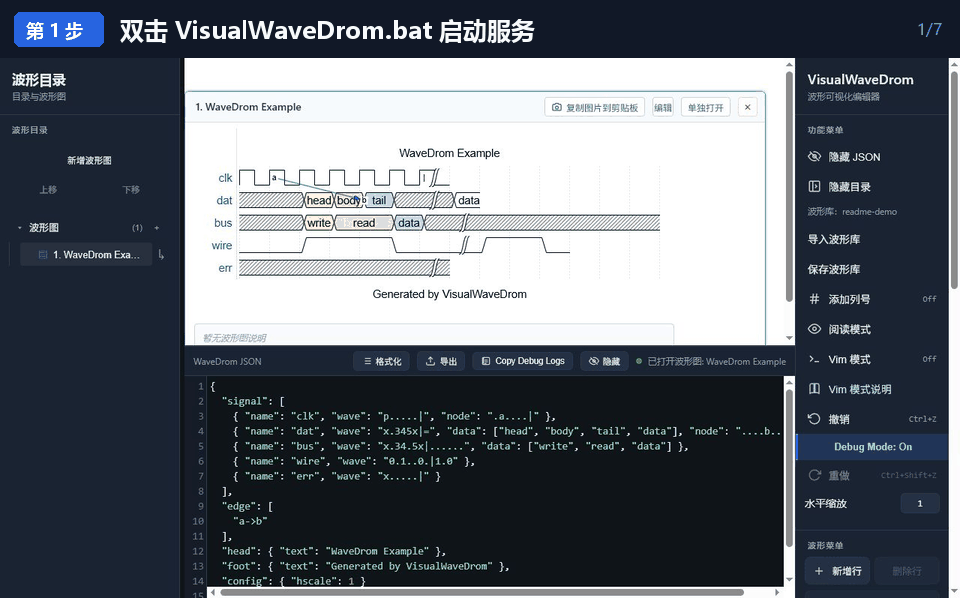
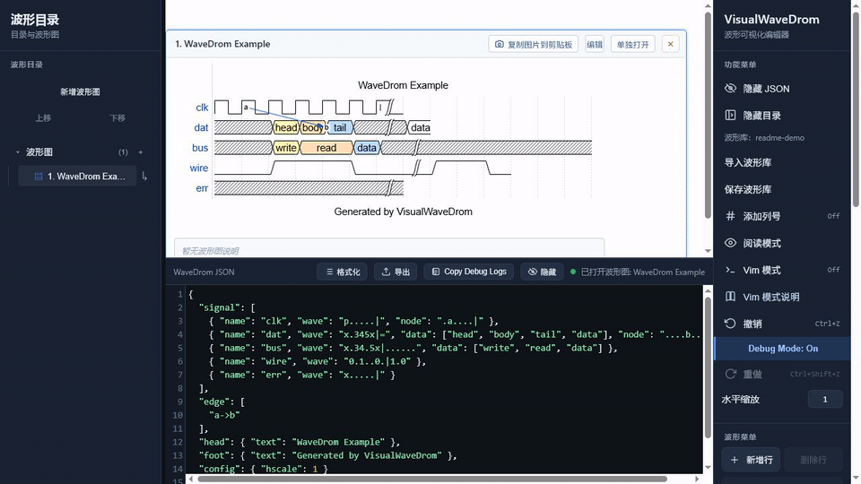
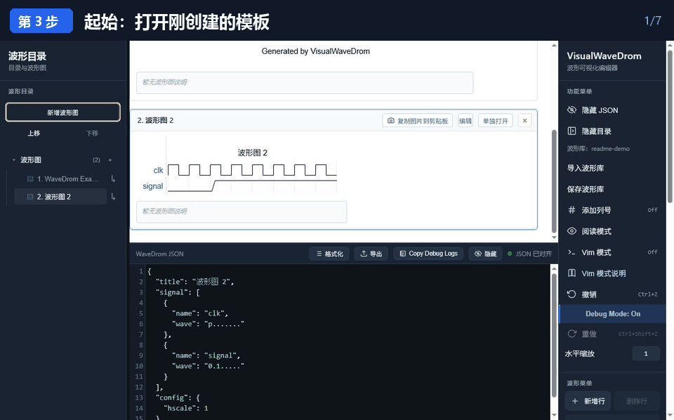
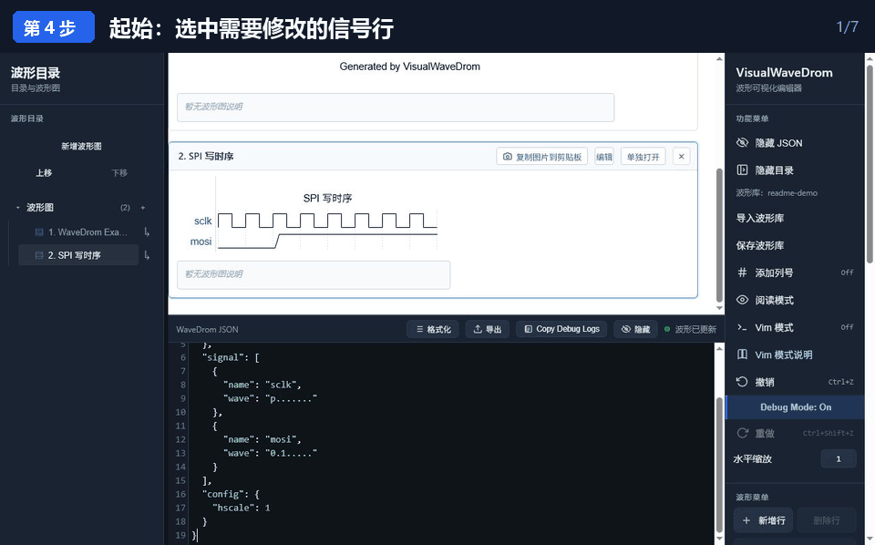
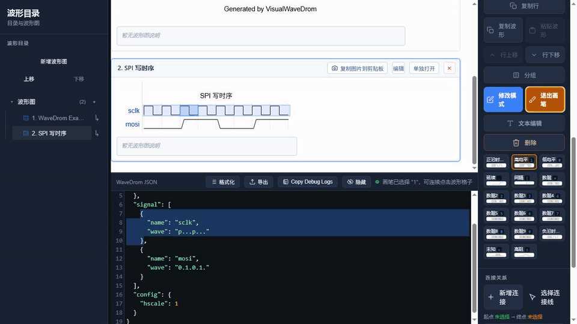
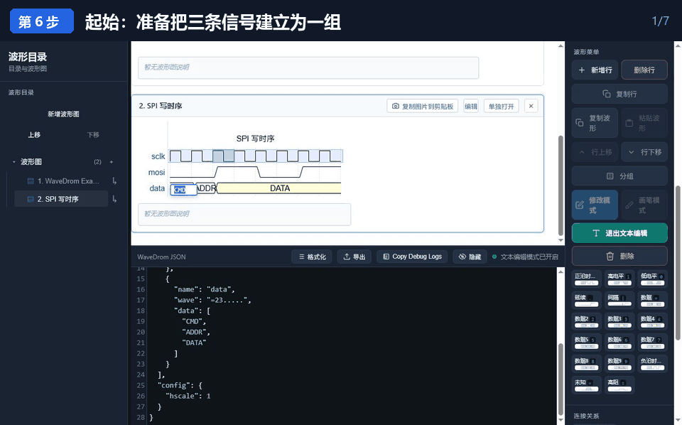
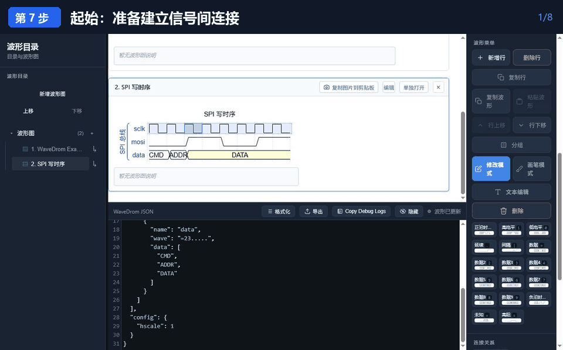
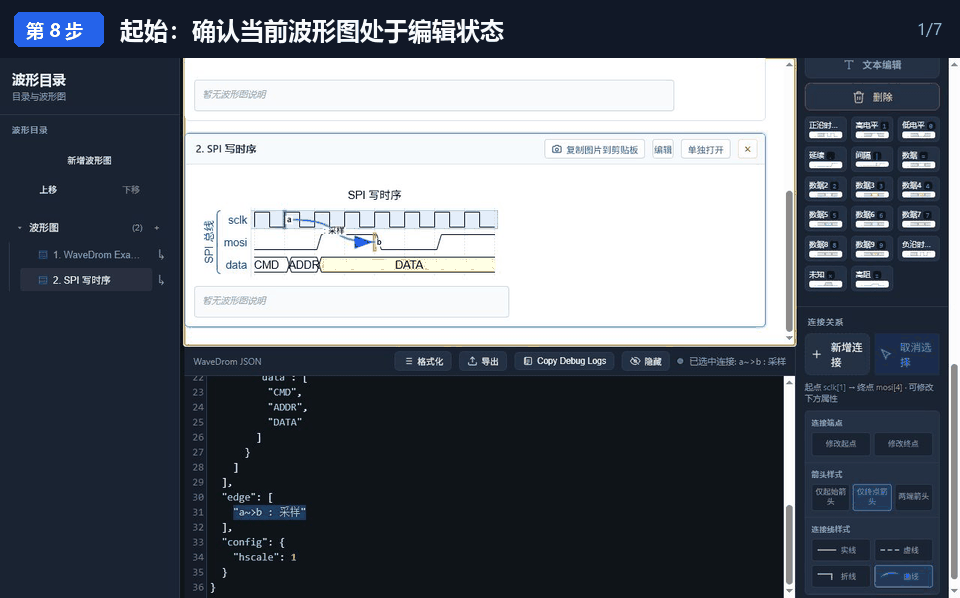
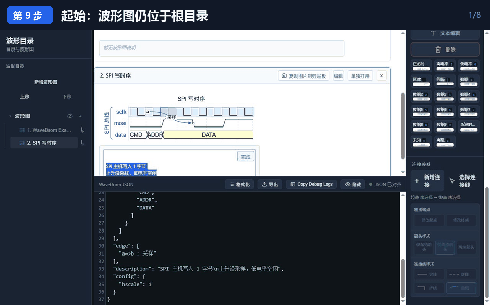
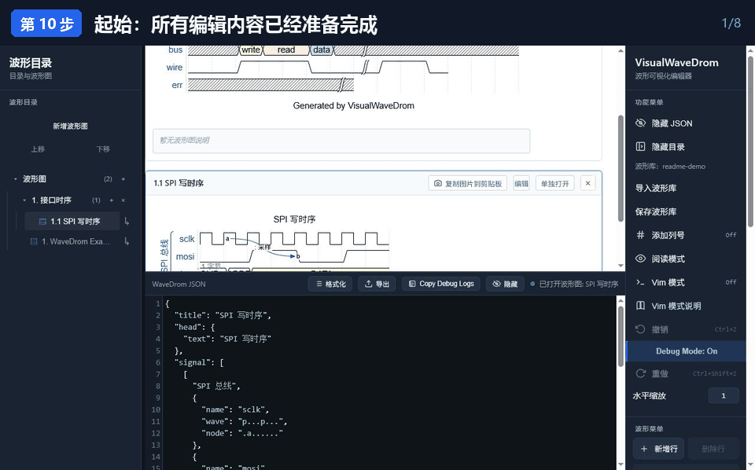

# VisualWaveDrom

VisualWaveDrom 是一个本地 WaveDrom 波形编辑器，支持多张波形图、波形目录、连接线、分组、说明文字和单图编辑。服务模式与直接打开 HTML 模式统一使用标准 SQLite 波形库。

## 快速开始

推荐使用服务模式。Windows 双击 `VisualWaveDrom.bat`，Linux 运行
`./VisualWaveDrom.sh`。默认打开：

```text
http://127.0.0.1:4173/VisualWaveDrom.html
```

端口 `4173` 已被其他程序占用时会自动选择空闲端口；同一工程的服务已经运行时会直接复用。

### Windows 启动

BAT 直接启动项目内的 `bin\VisualWaveDrom-server.exe`。服务端、SQLite
引擎和所需运行库已经包含在该静态程序中，不需要安装 Node.js、SQLite、Go，
不需要管理员权限，也不需要联网。

复制工程到其他 Windows x64 电脑时，应保留整个 `bin` 目录。可在命令提示符运行
`VisualWaveDrom.bat --check-runtime`，检查静态程序、内嵌 SQLite、HTML 和波形库路径，
但不启动服务。

HTML 文件名和默认波形库只需在 BAT 顶部配置：

```bat
set "HTML_FILE_NAME=VisualWaveDrom.html"
set "WAVE_LIBRARY_RELATIVE_PATH=Wave\VisualWaveDrom-library\library.sqlite"
```

路径以 BAT 所在目录为基准。工程整体复制到其他磁盘或电脑后，只要内部相对路径不变，就不需要修改绝对路径。关闭全部页面后，本地服务和 BAT 窗口会自动退出。

### Linux 启动

Linux x64 服务模式直接使用 `bin/VisualWaveDrom-server-linux-amd64`。该程序采用
纯 Go SQLite 驱动并以 `CGO_ENABLED=0` 构建，不需要安装 Node.js、sqlite3、Go
或 glibc。可以复制到使用 glibc 或 musl 的 Linux x64 系统中直接运行。

首次运行：

```bash
chmod +x VisualWaveDrom.sh
./VisualWaveDrom.sh
```

也可以始终使用 `bash VisualWaveDrom.sh`，不依赖脚本的可执行位。运行
`./VisualWaveDrom.sh --check-runtime` 可以检查静态程序、内嵌 SQLite、HTML 和波形库路径，
不会启动服务。服务器或 SSH 等没有图形桌面的环境使用：

```bash
./VisualWaveDrom.sh --no-open
```

终端会打印访问地址；在浏览器中打开该地址，结束时按 `Ctrl+C` 停止服务。

脚本只启动项目内的 Linux x64 静态程序。默认浏览器依次尝试 `xdg-open`、
`gio open` 和 `sensible-browser`，Firefox 116 及以上受支持。

Linux 的 HTML 文件名和默认波形库路径在 `VisualWaveDrom.sh` 顶部配置：

```bash
HTML_FILE_NAME="VisualWaveDrom.html"
WAVE_LIBRARY_RELATIVE_PATH="Wave/VisualWaveDrom-library/library.sqlite"
```

路径以脚本所在目录为基准，因此工程移动到其他 Linux 目录后不需要修改绝对路径。
首次正常启动时，如果系统提供 `xdg-mime`，服务会在当前用户范围注册单图链接协议；
该操作不需要管理员权限，但桌面环境仍可能要求用户确认默认处理程序。使用不支持
自定义链接协议的软件时，仍可先启动服务，再使用普通的本地 HTTP 单图链接。

## 简洁示例：从模板做一张 SPI 波形图

下面用一张 `SPI 写时序` 波形图演示最常用的完整流程。每张 GIF 都由多个关键画面组成，依次标出入口、点击位置、操作过程和最终结果；看不清文字时可以点击下面的“高清静态图”。

### 第 1 步：启动 VisualWaveDrom

**怎么做：** 双击项目根目录中的 `VisualWaveDrom.bat`。静态服务程序已随工程提供，
第一次运行也不需要安装或下载其他软件。

**看到什么：** 浏览器自动打开 VisualWaveDrom，左边是波形目录，中间是波形图和 JSON，右边是功能菜单与波形菜单。右侧显示 `波形库：库名称`，说明波形库已经载入。



[查看第 1 步高清静态图](ReadMeFig/01-start-service.png)

### 第 2 步：新建一张带模板的波形图

**怎么做：** 点击左上角的 **新增波形图**。

**看到什么：** 目录中出现一张自动编号的新图，中间出现包含 `clk` 和 `signal` 两行的初始模板；新图自动进入编辑状态，蓝色外框表示当前正在编辑它。



[查看第 2 步高清静态图](ReadMeFig/02-new-wave-template.png)

### 第 3 步：修改标题和信号名

**怎么做：** 点击右侧 **文本编辑** 进入文本编辑模式，再单击波形图标题或信号名。把标题改为 `SPI 写时序`，把两行信号名改为 `sclk` 和 `mosi`。再次点击 **退出文本编辑** 可以退出该模式。

也可以直接在下方 JSON 中修改 `title`、`head.text` 和每一行的 `name`。`title` 是波形框和目录中的名称，`head.text` 是波形图内部上方的标题。

**看到什么：** 波形框、波形图上方和左侧目录中的标题同步更新，信号名显示在对应波形左侧。



[查看第 3 步高清静态图](ReadMeFig/03-edit-title-signals.png)

### 第 4 步：用画笔画波形

**怎么做：** 先单击要修改的信号行，再点击右侧 **画笔模式**。选择 `高电平`、`低电平`、`正沿时钟`、`延续` 等波形按钮，然后单击对应格子；画笔模式不会在画完一格后自动退出，可以连续修改。完成后点击 **退出画笔**。

需要增加空行时点击 **新增行**。选中了某一行时，新行加在该行下方；没有选中行时，新行加在最下方。新增的空行仍可选中、命名和绘制。

**看到什么：** 被选中的格子立即换成当前画笔波形，JSON 中该行的 `wave` 同步变化并自动格式化。



[查看第 4 步高清静态图](ReadMeFig/04-paint-waveform.png)

### 第 5 步：增加数据波形和文字

**怎么做：** 新增一行并命名为 `data`，选择该行后用 `数据`、`数据2`、`数据3` 等按钮画出多个数据段。进入 **文本编辑** 模式，单击数据段，在小文本框中输入 `CMD`、`ADDR`、`DATA`。

数据波形和它上面的文字会作为整体处理。复制、粘贴、插入、删除或替换前面的波形时，已有数据文字仍跟随原来的数据段。

**看到什么：** 数据段内部显示输入的文字，JSON 中同时出现 `wave` 与按顺序对应的 `data` 数组。



[查看第 5 步高清静态图](ReadMeFig/05-data-labels.png)

### 第 6 步：给信号行分组

**怎么做：** 点击右侧 **分组**，再依次选择分组的起始行和结束行。起始行与结束行可以是同一行。输入分组名 `SPI 总线` 后确认。

分组可以嵌套成多级。要修改分组名，先进入 **文本编辑** 模式再单击分组标签；要删除分组，只需选中分组标签后点击 **删除** 或按 `Del`，信号行不会一起删除。

**看到什么：** 波形左侧出现分组括号和竖排标签，JSON 的 `signal` 中出现 WaveDrom 分组数组。



[查看第 6 步高清静态图](ReadMeFig/06-group-signals.png)

### 第 7 步：增加连接线和标签

**怎么做：** 点击 **新增连接**，先点击起点边沿，再点击终点边沿；空行和没有波形的间隔也可以选。然后点击需要的线段种类，默认箭头由起点指向终点。

需要修改时点击 **选择连接线**，再点击图中的连接线。此时可以修改起点、终点、起始箭头、终止箭头、实线、虚线、折线或曲线。要增加或修改连接标签，保持连接线选中，再进入 **文本编辑** 模式并点击标签，或者在 Vim 模式中按 `t`。

**看到什么：** 图中出现从 `sclk` 指向 `mosi` 的连接线和 `采样` 标签；选中后，右侧显示连接端点、箭头和线型属性。



[查看第 7 步高清静态图](ReadMeFig/07-add-connection.png)

### 第 8 步：填写多行波形说明

**怎么做：** 确认这张波形图处于编辑状态，然后单击波形图下方的说明框。直接按 `Enter` 换行，编辑完成后点击说明框右上角的 **完成**；点击说明框外部也会自动保存并退出。

**看到什么：** 说明显示在波形图内部下方的独立方框中，多行内容保持换行；JSON 中新增与 `signal` 并列的 `description` 字段。



[查看第 8 步高清静态图](ReadMeFig/08-edit-description.png)

### 第 9 步：把波形图整理到目录

**怎么做：** 点击根目录或某级目录右侧的 `+`，输入目录名 `接口时序`。点击波形图名称右侧的移动按钮 `↳`，再直接点击目标目录名称。

目录可以任意增加子目录。标题和波形图编号会根据层级、位置自动变成 `1.`、`1.1`、`1.2` 等；上移、下移或移动到其他目录后，所有受影响的编号都会自动更新。

**看到什么：** 左侧出现 `1. 接口时序`，波形图显示为 `1.1 SPI 写时序`。点击目录中的波形图只会定位并高亮它，不会改变同目录波形图的显示顺序。



[查看第 9 步高清静态图](ReadMeFig/09-organize-directory.png)

### 第 10 步：保存、截图和单独编辑

**怎么做：** 服务模式会自动保存每次有效修改，也可以点击右侧 **保存波形库** 立即确认保存。直接打开 HTML 时，完成编辑后必须点击 **保存波形库**，下载更新后的 SQLite 文件。

点击波形框上的 **复制图片到剪贴板**，可以选择“仅复制图片”“复制带链接截图”或“仅复制链接”。点击 **单独打开** 可以在新窗口只编辑这一张图，修改仍同步回同一个波形库。

**看到什么：** JSON 工具栏显示绿色状态 `已保存波形库：库名称`。此时可以安全关闭页面，或把整个工程与对应的 `Wave\库名称\library.sqlite` 一起交给别人。



[查看第 10 步高清静态图](ReadMeFig/10-save-and-share.png)

### 完成后的 JSON

下面是本示例最终对应的 WaveDrom JSON，可用来对照界面，也可以粘贴到新波形图的 JSON 区域后点击 **格式化**：

```json
{
  "title": "SPI 写时序",
  "head": {
    "text": "SPI 写时序"
  },
  "signal": [
    [
      "SPI 总线",
      {
        "name": "sclk",
        "wave": "p...p...",
        "node": ".a......"
      },
      {
        "name": "mosi",
        "wave": "0.1.0.1.",
        "node": "....b..."
      },
      {
        "name": "data",
        "wave": "=23.....",
        "data": [
          "CMD",
          "ADDR",
          "DATA"
        ]
      }
    ]
  ],
  "edge": [
    "a~>b : 采样"
  ],
  "description": "SPI 主机写入 1 字节\n上升沿采样，低电平空闲",
  "config": {
    "hscale": 1
  }
}
```

操作出错时可以打开右侧 **Debug Mode**，复现一次问题后点击 JSON 工具栏中的 **Copy Debug Logs**，把日志完整复制出来。

## 两种运行模式

### 服务模式

项目内的静态 Go 服务程序直接读写磁盘上的 SQLite 文件。

- 目录页只查询波形摘要，打开某张图时才读取该图的完整 JSON。
- 修改波形时只更新对应数据库记录；目录和归属关系使用同一事务保存。
- SQLite 引擎已嵌入静态程序，使用索引和事务；数据库采用可独立复制的单文件日志模式，
  不依赖额外的 `-wal` 文件。
- 每次写入保留波形修订号，用于发现完整页面与单图页面之间的同步冲突。
- 功能菜单中的“导入波形库”用于切换 `Wave` 下不同的波形库文件夹。
- 服务会记住最后一次成功打开的波形库；下次双击 BAT 时优先恢复该库。记录文件为 `Wave\.visualwavedrom-state.json`，它是本机状态，不需要随工程提交。
- Windows x64 与 Linux x64 服务程序均由同一份 `server-go` 源码生成，API 和波形库格式一致。

这是大型波形库、自动保存和 Word 单图链接的推荐模式。

### 直接打开 HTML

直接双击 `VisualWaveDrom.html` 不需要启动本地服务。页面会加载随项目提供的 SQLite WebAssembly 运行文件。

- “导入波形库”只接受标准 `.sqlite` 波形库文件。
- “保存波形库”始终下载标准 `.sqlite` 文件。
- 编辑中的 SQLite 快照保存在浏览器 IndexedDB，刷新页面后会自动恢复。
- 浏览器安全限制不允许网页静默覆盖用户选择的原文件，因此需要点击“保存波形库”下载更新后的文件。
- 只发送 HTML 文件不会携带浏览器中的波形；共享时应同时发送导出的 SQLite 文件和 `inc` 目录。

## 按预设方案导入信号行

服务模式下，功能菜单提供 **导入波形数据**，波形菜单中的 **导入行波形** 也会打开
同一个导入流程：

1. 从电脑中选择 `.txt`、`.csv`、`.tsv`、`.dat` 或 `.log` 数据文件；服务模式下也可以
   在“文件路径”中直接粘贴路径并点击 **读取路径**。
2. 页面读取并显示文件前 5 行，自动判断单列、逗号、Tab 或空白分隔格式，分析第一列
   是否为递增序号，并推荐适合的 Python 文件处理函数和预设。
3. 用户填写导入后的信号名，并可用鼠标改选 `import/Scheme` 中的其他 JSON 预设。
4. 点击 **生成预览**。通过文件选择器上传的文件由服务放入系统临时目录解析，解析完成
   后立即删除；通过路径读取时，服务直接读取原文件，不需要把整份文件传回浏览器。
5. 确认效果图后点击 **确认导入**。信号名已存在时更新该行，不存在时在当前波形图末尾
   新增同名信号行。

预览最多显示前 200 列，但确认导入时会写入完整波形。任一文件、解析函数或信号名有误
时不会修改当前波形图；只有成功生成效果图并点击确认后才会进入撤销历史、触发格式化、
渲染和波形库自动保存。

Linux 可直接粘贴 `/home/user/data.csv`、`~/data.csv` 或 `file:///home/user/data.csv`；
带空格的路径可以直接粘贴，也支持外层单引号或双引号。相对路径以 VisualWaveDrom
工程目录为基准。路径读取只在 BAT/SH 服务模式可用，直接双击 HTML 时仍需使用文件选择器。

### 按预设集合批量导入

波形菜单中的 **导入波形数据预设集合** 用于从一个数据目录中查找并一次导入多路信号。
此功能需要由 BAT/SH 启动的服务模式：

1. 选择数据文件夹，再选择集合预设 JSON；Linux 没有图形文件选择器时也可以直接粘贴路径。
2. 页面读取 `vars`，为每个变量生成输入框。
3. 点击 **搜索**。程序把变量代入每条 `paths` 规则，在 `数据文件夹/folder` 中递归搜索文件，
   并在窗口中列出文件、目标信号名和匹配状态。
4. 每条规则必须恰好匹配一个文件，且生成的信号名不能重复，之后 **确定导入** 才会可用。
5. 可以直接修改窗口中的预设 JSON。点击 **保存预设** 时，文件选择器默认定位到原预设路径。

`import/SchemeCollection/example.json` 是可直接修改的示例：

```json
{
  "vars": [
    "channel",
    "case"
  ],
  "paths": [
    {
      "folder": "Data",
      "grepKeys": "^${channel}-${case}\\.txt$",
      "hasSeq": true,
      "name": "${channel}_${case}"
    }
  ]
}
```

使用这份示例时，数据文件夹选择工程中的 `import`，`channel` 填 `basic`，`case` 塨
`signal`，会匹配现有的 `import/Data/basic-signal.txt` 并导入为 `basic_signal`。

- `vars`：需要用户填写的变量名列表。
- `folder`：相对于本次选择的数据文件夹的搜索目录；可以为 `.`，且不能跳出所选目录。
- `grepKeys`：匹配文件名的 Go 正则表达式。变量可写成 `${var}`、`{{var}}` 或 `{var}`；
  用户输入的变量值按普通文本参与正则匹配，不会被当作额外正则语法。
- `hasSeq`：`true` 表示第一列是序号，`false` 表示程序从 0 自动编号。
- `name`：导入后的信号名，也可以使用变量。检测到复数数据时仍会自动生成 `_I` 和 `_Q` 两路。

搜索只读取文件信息和少量样本；点击确定后才解析完整文件。整批解析成功后才统一修改当前波形图，
因此缺失文件、重复匹配或某个文件解析失败不会留下半批数据。

目录结构如下：

```text
import/
├─ Scheme/                 多个导入预设方案
│  ├─ basic-index-data.json
│  ├─ basic-csv-index-data.json
│  ├─ basic-tsv-index-data.json
│  └─ single-column-data.json
├─ SchemeCollection/       批量搜索与导入预设集合
│  └─ example.json
├─ Data/                   建议存放待导入的数据文件
│  ├─ basic-signal.txt
│  ├─ basic-signal.csv
│  ├─ basic-signal.tsv
│  ├─ analog-signal.csv
│  └─ single-column-signal.txt
└─ inc/
   └─ fileProc.py          Python 文件解析函数
```

方案示例：

```json
{
  "version": 1,
  "name": "基础序号数据导入",
  "description": "把文件内容导入 signal 行",
  "mappings": [
    {
      "file": "Data/basic-signal.txt",
      "signal": "signal",
      "parser": "parse_index_data",
      "options": {
        "delimiter": "auto",
        "encoding": "utf-8-sig"
      }
    }
  ]
}
```

- `file` 相对于 `import` 文件夹；也可以写成
  `import/Data/basic-signal.txt`。它为预设提供示例/默认文件，并继续供旧接口使用；从界面
  选择文件时会改用用户刚选择的文件。为保证工程可整体搬移和避免误读其他文件，不能使用
  绝对路径或跳出 `import` 文件夹。
- `signal` 是预设的默认目标信号名；界面导入时改用用户在“导入后的信号名”中填写的值。
- `parser` 是 `import/inc/fileProc.py` 的已注册解析函数。内置
  `parse_index_data`、`parse_csv_index_data`、`parse_tsv_index_data` 和
  `parse_single_column`。
- `options` 可设置 `delimiter`、`encoding`、`skipRows`、`commentPrefixes`、
  `stateMap`、`valueMode`、`fillLeading`、`fillGap` 和 `maxColumns`。默认自动识别逗号、Tab 或空白分隔，
  `#` 与 `//` 开头的行作为注释。

Python 处理固定分成两步：

1. **文件解析**：方案中的 `parser` 只读取文件并返回
   `{"points":[{"index":0,"value":"0"}]}` 格式的点列。
2. **信号补全**：程序固定调用内置 `complete_previous_value`，统一处理起始缺口、离散序号、
   WaveDrom 状态转换以及 `wave/data` 绑定。预设方案不需要、也不能指定第二步函数。

新增自定义文件格式时，用户只需在 `fileProc.py` 中增加一个签名为
`parse_xxx(file_path, options=None)` 的解析函数，并把它加入 `FILE_PARSERS`；不需要编写
任何波形补全代码。

基础解析函数按以下规则工作：

```text
# 双列：第一列序号，第二列数据
2 0
3 1
5 x

# 单列：没有序号时，按 0、1、2……自动编号
0
1
x
```

双列文件的序号必须从小到大且不能重复。文件不从序号 0 开始时，第一个序号之前因为没有
历史值而补为 `x`；两个离散序号之间使用 `.` 延续上一个序号的值。以上双列示例会生成
`xx01.x`。单字符 WaveDrom 状态直接写入
`wave`，其他文本会转换为数据波形 `=` 并同步写入 `data`，因此波形和文字保持绑定。
数值文件还会保留完整的 `samples` 数组：只有 `0/1` 时默认识别为数字信号，其他数值
默认识别为模拟信号。离散序号之间的采样值延续前一个序号，首个序号之前没有历史值的
位置保留为空。普通 WaveDrom 视图继续使用 `wave/data`，示波器视图会优先使用这些
原始数值采样。
导入会进入撤销历史并触发格式化、渲染和波形库自动保存。已有连接端点超出新文件长度时，
页面会在末尾补 `x` 以保留端点。

`fileProc.py` 只使用 Python 标准库，语法兼容 Python 3.6、3.7 和 3.12。服务会依次
查找环境变量 `VWD_PYTHON_EXE`、项目内 `import/python-runtime`、Windows Python
Launcher 或系统 `python3/python`。直接双击 HTML 的模式受浏览器安全限制，不能调用
本机 Python，因此该功能只在 BAT/SH 服务模式中启用。

## SQLite 波形库

`Wave` 是波形库根目录。每个一级子文件夹是一套独立波形库，文件夹名称就是界面中的库名称：

```text
Wave\
├─ VisualWaveDrom-library\
│  └─ library.sqlite
└─ OtherLibrary\
   └─ library.sqlite
```

一个 `library.sqlite` 包含：

- 每张波形图的 WaveDrom JSON、标题缓存、说明和修订号。
- 多级波形目录、显示顺序和波形归属关系。
- 当前编辑波形图、当前选择目录和永久 `libraryId`。

SQLite 虽然是单文件，但会使用数据库页和索引按需读取，不需要像单个巨大 JSON 那样先解析全部波形。服务端修改单图时也不重写整个库。单张波形 JSON 小于 256 KiB 时直接保存在文档记录中；达到该大小后自动按 64 KiB 拆入同一个 SQLite 文件的分块表。读取时会透明拼回完整 JSON，库文件仍然只有一个，不会产生外部碎片文件。旧版 SQLite 波形库首次打开时会自动补充分块表，不需要手工转换。

当前版本只支持 SQLite 波形库，不再读取、迁移或导出旧 JSON 波形库。

## 大波形与浏览器兼容

当单行最长波形达到 2000 列时，页面自动进入大波形窗口模式：

- SQLite 和 JSON 仍保存完整波形，文件格式及单文件存储方式不变。
- 页面只渲染当前可见的 24 至 320 列，窗口大小会根据波形区宽度自动调整。
- 波形下方的滚动条可快速定位任意列，也可以使用前后窗口按钮或 `Shift + 滚轮` 横向移动。
- 鼠标选择、画笔、连接端点、数据标签和 Vim 光标都使用完整波形的绝对列号；Vim 光标移出当前窗口时会自动翻到对应列。
- 跨越当前窗口的连接线会在窗口边界继续显示，不会修改原始连接端点。

复制图片时，少于 200 列会直接生成完整截图；达到 200 列时会弹出起始列和结束列。弹窗优先填入当前屏幕正在显示的列范围，用户可以在此基础上修改后再截图。截图仍不包含波形图下方的 `description` 说明。

当前目标浏览器为 Chrome、Edge，以及 Firefox 116 或更高版本。Firefox 在
Windows 和 Linux 下使用同一套页面逻辑；Linux 字体会优先使用 Noto 和 Liberation
系列回退字体。为兼容 Firefox 不同版本的 PNG 剪贴板行为，Firefox 116 及以上统一采用可靠降级路径：“复制图片”会自动下载 PNG，复制带链接截图时还会同时复制单图链接。Firefox 128 及更高版本同样受支持。

Firefox 116 不使用较新的 `content-visibility` 优化，页面会通过
`IntersectionObserver` 卸载屏幕外的波形预览作为回退，功能不受影响；波形图数量极多时，
新版 Firefox 或 Chromium 浏览器的滚动性能可能更高。

Linux 上推荐通过 `VisualWaveDrom.sh` 使用 `http://127.0.0.1` 服务模式。直接用
`file://` 打开 HTML 仍可导入和导出 SQLite，但 Firefox 对本地文件的 IndexedDB、
Worker 和剪贴板权限可能受发行版安全策略影响，不能保证与服务模式完全一致。

## 示波器模式

每个波形图卡片都有 **示波器** 按钮。点击后会打开一个可调整大小的独立窗口，只加载
当前波形图，适合查看和整理数千至数百万列的数据。该窗口不受 WaveDrom 图形样式限制，
使用高密度 Canvas 绘制，共用时间轴，并冻结左侧信号名称。

- 每个信号可以独立选择 **数字**、**总线** 或 **模拟** 显示。
- 每个信号可以从预设色板中独立设置波形颜色，并设置整行背景色；还可以用列号、列区间或 A/B 游标范围，
  为指定列设置不同的背景色。
- 模拟显示的信号行底部带有行高调整线；按住并上下拖动即可放大或缩小该行。数字和总线
  模式保持紧凑标准行高，默认行高为原版的一半；重新切回模拟模式时会恢复该信号上次调整的高度。
- 默认只显示简化结果并占满整行；打开 **原始数据** 开关后，上半行显示原始数据，
  下半行显示当前简化结果，可直接进行前后对比。
- 支持缩放、`Shift+拖动`（或鼠标中键拖动）平移、适合窗口、纵向虚拟滚动和底部总览图。
  左侧信号名由右侧波形区统一驱动滚动，两侧始终保持同一位置和速度。
- A/B 两条游标始终可见，可测量两个位置、时间差和倒数。
- 数字与总线信号保留跳变边沿；`p/P/n/N` 时钟按半周期显示，`P/N` 的有效边沿标记和
  `|` 间隔会保留；同一总线信号中相邻且数值相同的列会合并为一个显示区段；模拟信号
  使用选定的数值类型绘制曲线。
- 窗口只请求当前可见的信号行和横向范围，绘制数据量受画布像素宽度限制。
- 大量模拟数据会自动建立多级 LOD；计算、抽取和简化在 Web Worker 中完成，避免阻塞界面。
- 通过 `file://` 直接打开而无法启动 Worker 时，会自动使用同一算法的页面内兼容实现。

### 波形颜色和行背景

1. 单击信号名称左侧的颜色小方块，打开该信号的颜色设置窗口。
2. 在弹出窗口中从固定色板选择波形颜色或整行背景色；对应的清除按钮可以恢复自动波形色
   或透明行背景，不需要输入 RGB 数值。
3. 退出游标测量后，也可以在一行波形上按住鼠标左键拖动选择连续多列，选择结果会自动
   填入 **指定列**。也可直接输入 `1,3-5` 这样的列号，在工具栏的预设色板选择颜色后点击
   **应用列背景**。点击
   **使用 A-B** 可以自动填入两个游标之间的列；**清除列背景** 只清除输入范围内的覆盖色。

样式修改会先保存在当前示波器窗口的草稿中，不会立即改动原波形。工具栏显示
**未保存** 后，点击 **保存修改** 才会把显示模式、模拟解析方式、行高、波形颜色和背景色
写入信号的 `scope` 字段；关闭或离开含未保存草稿的窗口时，浏览器会进行提示。列背景采用
`backgroundRanges` 区间存储，`start` 为从 0 开始的包含位置，`end` 为不包含的结束位置，
因此大波形不会为每一列生成一条配置。

### 游标定位和跳转

1. 点击工具栏的 **A** 或 **B**，或直接点击画布中的游标竖线，选择当前工作游标。开启
   **游标测量** 后可以直接按住 A/B 竖线拖动；拖动过程中，左侧每个信号名旁的当前值会实时更新。
2. 单击左侧信号行，选择边沿、指定值和条件跳转所使用的信号。每个信号名下方会显示
   该信号在当前工作游标时刻的值。
3. 使用“边沿”左右按钮跳到该信号的上一个或下一个跳变；时钟的半周期边沿也可跳转。
4. 在“值”输入框填写数字信号的 `0/1/x/z`、总线文本或模拟数值，再使用左右按钮查找
   上一个或下一个匹配位置。按 Enter 等同于向后查找，Shift+Enter 等同于向前查找。
5. 在“条件”输入框填写 `==1`、`>=10`、`>=10 && <20` 或 `==READY`，再使用左右按钮
   查找条件由假变真的交界。条件保持为真或由真变假都不会作为目标；条件支持
   `==`、`!=`、`>`、`>=`、`<`、`<=`、`&&` 和 `||`。Enter 向后查找，
   Shift+Enter 向前查找。
6. 开启 **游标测量** 后，单击或拖动波形区域可移动当前工作游标。松开鼠标时，游标会吸附到所点信号最近的
   列边界或真实跳变边沿，不会停在任意小数位置；时钟的半周期边沿同样支持吸附。底部持续
   显示 A、B、`Δt` 和 `1/Δt`。

### 从大波形生成展示实例

1. 在 **起始列** 和 **结束列** 中指定需要提取的原始范围，也可以点击 **使用当前窗口**。
2. 选择简化方法并填写目标点数。
3. 点击 **生成简化实例**。默认只显示简化结果；需要对比时打开 **原始数据** 开关，
   上、下两条波形分别显示原始结果和简化结果。
4. 单击简化波形中的点，可修改值或总线文字、插入点、删除点，或把该位置设为关键点。
5. 使用示波器窗口内的撤销/重做按钮检查调整过程。
6. 点击 **保存为展示实例**，会在原波形所在目录中新增一张普通 WaveDrom 波形图，
   不会修改原图。
7. 点击 **保存修改** 才会写回原波形。只修改显示设置时会保留原始波形的全部列；
   已生成或手工编辑简化数据时，会先请求确认，再用当前简化结果更新原波形。

内置简化方法包括保留事件、保留跳变、均匀抽样和 LTTB。数字/总线信号会优先保留边沿
及标签，模拟信号会保留峰谷特征；手工锁定的关键点不会被后续简化丢弃。状态栏会显示
原始点数、结果点数、压缩比例、跳变保留情况和模拟近似误差。

展示实例仍是可在普通编辑器中继续修改的标准 WaveDrom JSON。为便于回溯，根对象会增加
`scopeInstance` 元数据，记录源波形 ID、源修订号、原始列范围、简化方法、列映射和各行
显示模式；连接端点与连接线不会复制到展示实例。

模拟采样可以保存在信号行的 `scope` 字段中：

```json
{
  "name": "channel_A",
  "wave": "=...",
  "data": ["0.00", "0.25", "0.80", "0.10"],
  "scope": {
    "mode": "analog",
    "unit": "V",
    "numericType": "float",
    "bitWidth": 32,
    "fractionalBits": 0,
    "samples": [0, 0.25, 0.8, 0.1]
  }
}
```

选中信号行并切换为 **模拟** 后，工具栏的“模拟解析”可选择：

- `unsigned`：无符号整数。
- `signed`：按所选位宽使用二进制补码解释。
- `ufixed` / `sfixed`：无符号或补码有符号定点数，实际值为原始整数除以
  `2^fractionalBits`。
- `float`：32 位或 64 位浮点数。十进制文本直接按浮点值读取，`0x`/`0b` 开头的文本
  按 IEEE 754 原始位读取。

这些设置针对当前选中的信号保存。`wave/data` 中的总线文字会按设置转换；已经写入
`scope.samples` 的数组视为实际数值，不再进行第二次定点或补码换算。

服务模式会把保存结果直接写入当前 SQLite 波形库，并同步回主窗口。直接打开 HTML 时，
结果先写入浏览器中的 SQLite 快照；需要再点击 **保存波形库** 下载更新后的 `.sqlite`
文件，浏览器不能静默覆盖用户原来选择的文件。

## 备份和共享

1. 服务模式下，复制整个 `Wave` 文件夹即可携带全部波形库。
2. 纯 HTML 模式下，点击“保存波形库”下载当前 `.sqlite` 文件。
3. 在另一台电脑上通过“导入波形库”选择该 SQLite 文件。
4. 重要修改后建议保留一份关闭服务后复制的 `library.sqlite` 备份。

## Word 带链接截图和单图模式

每张波形图卡片都提供“复制图片到剪贴板”按钮。点击后可以选择：

- “仅复制图片”：复制不带链接的 PNG。
- “复制带链接截图”：同时复制 PNG、Word 可识别的 HTML 图片链接和纯文本链接。
- “仅复制链接”：只复制该波形图的单图链接。

完整波形库中的每张波形图还提供“单独打开”按钮。点击后会在新窗口或新标签页打开与 Word 超链接相同的单图页面，只渲染目标波形图，编辑结果仍会定向写回当前波形库。

带链接截图仍然不包含波形图下方的 `description` 说明。粘贴到 Word 后，点击图片会通过为当前波形库注册的 `visualwavedrom-…://` 链接打开目标波形图。单图页面隐藏波形目录和其他波形图，但保留工具栏和 JSON 编辑区；修改有效 JSON 后会自动定向写回原波形库中的同一张图，不改变其他波形、目录关系或排列顺序。

服务模式会为波形库和波形图补充永久 ID，并使用版本号防止两个页面静默覆盖同一张图。同一浏览器中同时打开完整波形库和单图页面时，保存后会自动刷新另一页面；若两边同时存在未保存修改，会提示同步冲突。

### 第一次在新电脑使用 Word 链接

1. 保持 Word、VisualWaveDrom 和波形库之间的相对目录结构不变。
2. 在新电脑上先正常双击一次 `VisualWaveDrom.bat`。
3. BAT 会在当前用户范围自动注册波形库专用链接协议，不需要管理员权限；不同工程可以同时保留各自的 Word 链接。
4. 此后点击 Word 中的带链接图片，即使服务没有运行，也会自动启动 BAT、打开服务并进入对应单图页面。

注册信息中会记录当前 BAT 的绝对位置。项目整体移动到新位置后，重新双击一次新位置中的 BAT 即可更新注册信息。直接打开 HTML 的模式受浏览器权限限制，不能通过 Word 链接自动写回原始波形库。

## 波形目录和波形图

左侧“波形目录”用于组织多张波形图。

- 根目录的 `+` 可新增目录标题。
- 可创建多级目录。
- “新增波形图”会在当前选中目录下创建带 `clk`、`signal` 两行的初始模板；未选中目录时会放在根目录。
- 目录内可包含多张波形图。
- 点击目录中的波形图标题会打开该图进行编辑，当前编辑图会以高亮边框显示。
- 波形图卡片提供删除和移动操作。
- 移动时，在弹出的目录列表中直接单击目标标题即可完成移动。
- 删除目录时，目录中的波形图和子目录会提升到上一级目录。

## 撤销和重做

工具栏的撤销/重做，以及 `Ctrl+Z` / `Ctrl+Shift+Z`，支持：

- JSON 与波形编辑。
- 新增、删除、移动信号行。
- 新增、删除分组。
- 新增、删除、移动波形图。
- 新增、删除目录和子目录。
- 将波形图收录或移动到其他目录。

删除波形图后可立即撤销，恢复原波形内容和原目录位置。

## 编辑波形

右侧工具栏提供信号行、波形符号、分组、连接线和缩放工具。

### 信号行

- 新增行会创建可选中的空信号行。
- 单击信号名称可编辑名称。
- 可上移、下移、删除信号行。
- 选中一行后，点击波形符号可写入或插入波形字符。
- 工具栏造成波形 JSON 变化后会自动格式化 JSON。

### 数据标签

数据格式字符 `2` 到 `9` 以及 `=` 可对应 `data` 数组中的文字。

- 即使初始没有文字，单击数据格也可以输入数据标签。
- `4444` 表示四个独立数据格，可分别编辑四个标签。
- `4...` 表示一个延续数据格，点击 `4` 或后续的 `.` 编辑同一个标签。
- 输入数据标签后按 Enter 保存。

### 分组

1. 点击“分组”。
2. 在波形区依次选择起始行和结束行；起止行可以相同。
3. 新分组会写入 WaveDrom 的嵌套 `signal` 数组，支持多级分组。

单击分组标签可选中分组；双击分组标签可修改文字。选中分组后使用删除按钮只会删除分组标签，波形行会保留。

### 连接线

1. 点击“新增连接”。
2. 在波形边沿依次选择起点和终点。
3. 选择箭头样式并填写可选标签。
4. 点击样式即可生成连接线。

连接线写入 WaveDrom JSON 的 `edge` 字段。选中已有连接线后可修改样式、标签或删除。

### 波形说明

每张波形图可使用顶层 `description` 字段保存说明文字。

- 说明框位于波形图卡片底部。
- 仅当前编辑中的波形图可编辑说明。
- 说明编辑框支持换行；点击“完成”保存。
- 说明内容较长时，波形区域支持滚动查看。

## JSON 面板

JSON 面板标题栏中的“隐藏”按钮可以直接隐藏 WaveDrom JSON 编辑窗口；隐藏后可通过功能菜单中的“显示 JSON”恢复。显示状态会保存到浏览器本地设置中。

“全屏”会让 JSON 面板覆盖整个浏览器视口，按 `Esc` 或再次点击按钮退出。
“紧凑”会缩小工具栏、字号和行间距。最长波形不超过 200 列时，长 JSON 行会自动折行；超过 200 列后自动关闭折行并恢复横向滚动，避免浏览器为超长行反复计算布局。紧凑模式会保存到浏览器本地设置中；Chrome、Edge 和 Firefox 116 以上行为一致。

JSON 标题栏提供三种显示范围：

- **摘要**：只显示标题、说明、信号数量、最长列数和各信号概况，内容只读。
- **窗口**：只显示当前波形窗口的 24 至 320 列。可以直接修改窗口 JSON，点击“应用窗口”后会合并回完整波形；窗口外的波形、数据标签和连接信息保持不变。
- **完整**：按需显示整张波形的 JSON。大型 JSON 默认只读并关闭语法高亮，点击“编辑完整 JSON”后才会解锁，防止误输入触发大文本处理。

超过 200 列的波形首次打开时默认使用“窗口”视图。编辑器会在输入停顿约 0.36 秒后才同步完整文本，波形解析采用较长防抖并取消过期任务；直接编辑 JSON 的撤销记录使用增量修改，不再每次扫描并保存整份文本。窗口合并和撤销内部使用分块字符串处理，长 `wave` / `node` 内容不会因一次小修改产生多轮整串复制。

功能菜单中的“添加列号”按 `Off → Tick → Tock → Off` 循环：`Tick` 写入 `head.tick`，在列边界显示编号；`Tock` 写入 `head.tock`，在列中间显示编号。首次启用默认从 `0` 开始，切换模式时保留已有起始编号，并支持撤销和重做。

JSON 面板提供格式化和导出功能。JSON 解析失败时，错误行左侧会显示 `×`。

## Vim 模式

功能菜单中的“Vim 模式”用于开启或关闭波形区域的键盘操作，开关状态会保存在浏览器中。“Vim 模式说明”按钮或 `?` 可打开完整使用手册。Vim 只在当前编辑波形图的波形区域内生效；单击目录、工具栏、JSON 或说明区后，按键恢复为这些区域的普通操作。底部状态栏会显示当前模式、是否聚焦波形、数字前缀和等待中的组合键。

### 波形和信号行

- `h`、`j`、`k`、`l`：移动波形光标；支持数字前缀，例如 `5l`。
- `w`、`b`：跳到后一个或前一个波形变化点；`e` 跳到当前或下一波形段末尾；这些移动均支持数字前缀。`0`、`$`、`gg`、`G` 跳到边界。
- `v`：按波形格选择；`V`：按信号行选择；`o` 交换可视选择起点和终点。
- `y`、`p`、`x`：复制、覆盖粘贴、删除选中的波形格。
- `r` 后输入一个波形字符执行一次替换；`R` 进入连续替换，按 `Esc` 退出；`|` 可以直接把当前选中位置替换为间隔。
- `i`、`I`、`A`：分别从当前格、当前行首、当前行末进入波形插入模式；输入波形字符后光标向后移动。`Backspace` 删除光标左侧波形并左移，`Delete` 删除光标右侧波形且光标位置不变，按 `Esc` 退出。
- `t`：当前选中内容可编辑时，直接打开数据、分组或连接标签输入框。
- `yy`、`dd`：复制或删除当前信号行。复制行不会复制连接端点使用的 `node` 字段。
- `o`、`O`：在当前行后方或前方插入空白信号行。
- `[r`、`]r`：上移或下移信号行；可使用数字前缀指定移动数量。
- 可视行模式下按 `Space`、`g`，可将选中的连续信号行建立为分组。

### 生效范围和其他操作

- 不再提供区域切换组合键；目录、工具栏、JSON 和说明区不使用 Vim。
- Vim 开启时，JSON 编辑器只作只读显示，不能获得编辑光标或选择代码；关闭 Vim 后恢复普通编辑。
- `Space`、`a`：在波形区域开始新增连接；`Space`、`c`：选择已有连接线。
- `u`、`Ctrl+r`：使用 VisualWaveDrom 的统一历史记录撤销和重做；`.` 重复最近一次可重复修改。

### 命令行

按 `:` 打开命令行。打开波形图时只输入目录中的自动编号，不输入标题，例如：

```vim
:open 1.2
```

常用命令还包括 `:w` 保存波形库、`:format` 格式化 JSON、`:json` 显示或隐藏 JSON、`:nav` 显示或隐藏目录、`:new` 新建波形图、`:debug` 切换调试模式、`:noh` 清除高亮，以及 `:set vim` / `:set novim`。

## 调试模式

功能菜单可以打开 Debug Mode，并复制调试日志。

调试日志用于定位点击、数据标签、分组标签、连接线和波形库操作问题。提交问题时，请附上复制出的完整日志，以及所使用的 SQLite 波形库（如可公开）。

## 文件说明

```text
VisualWaveDrom.html      主页面
VisualWaveDrom.bat       Windows 双击启动入口
VisualWaveDrom.sh        Linux 启动入口
bin/VisualWaveDrom-server.exe Windows x64 静态服务程序
bin/VisualWaveDrom-server-linux-amd64 Linux x64 静态服务程序
bin/SHA256SUMS.txt        两个平台程序的 SHA-256
server-go/                静态服务源码、SQLite 数据层和测试
inc/                     页面样式、应用逻辑和依赖库
inc/sqlite/              直接打开 HTML 使用的 SQLite WebAssembly 文件
inc/visualwavedrom-vim.js Vim 键盘控制器
import/                  行波形导入方案、数据文件和 Python 解析函数
Wave/                    多个 SQLite 波形库
tools/GenerateReadMeGifs.py README 示例动画生成脚本
tools/BuildGoServer.ps1   Windows/Linux x64 静态程序构建脚本
```

每套波形库固定保存在 Windows 的 `Wave\<波形库名称>\library.sqlite`，或 Linux
的 `Wave/<波形库名称>/library.sqlite`。每个 SQLite 文件都可以独立复制、备份和导入。

## 常见问题

### 为什么复制 HTML 后看不到我的波形？

直接打开 HTML 时，SQLite 快照保存在当前浏览器的 IndexedDB 中，不会嵌入 HTML。请使用“保存波形库”导出 `.sqlite` 文件，或使用服务模式并复制 `Wave` 文件夹。

### 为什么无法选择任意路径自动保存？

浏览器安全策略不允许纯 HTML 任意写入本机文件。服务模式将数据固定写入项目的 `Wave` 文件夹，以便可靠备份和共享。

### 为什么同一个数据格只显示一个标签？

`4...` 是一个延续数据格；需要多个独立标签时，请使用多个数据字符，例如 `4444`。
