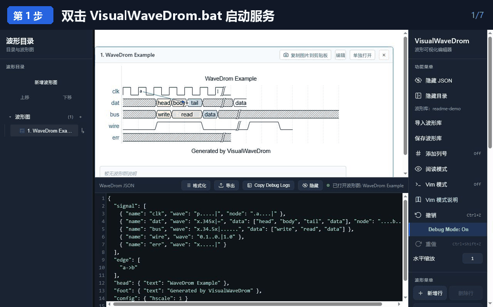
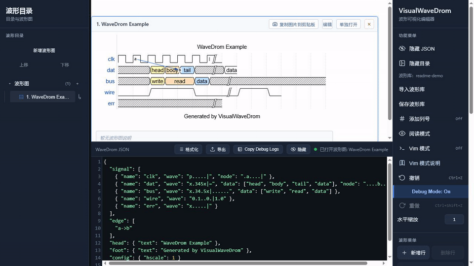
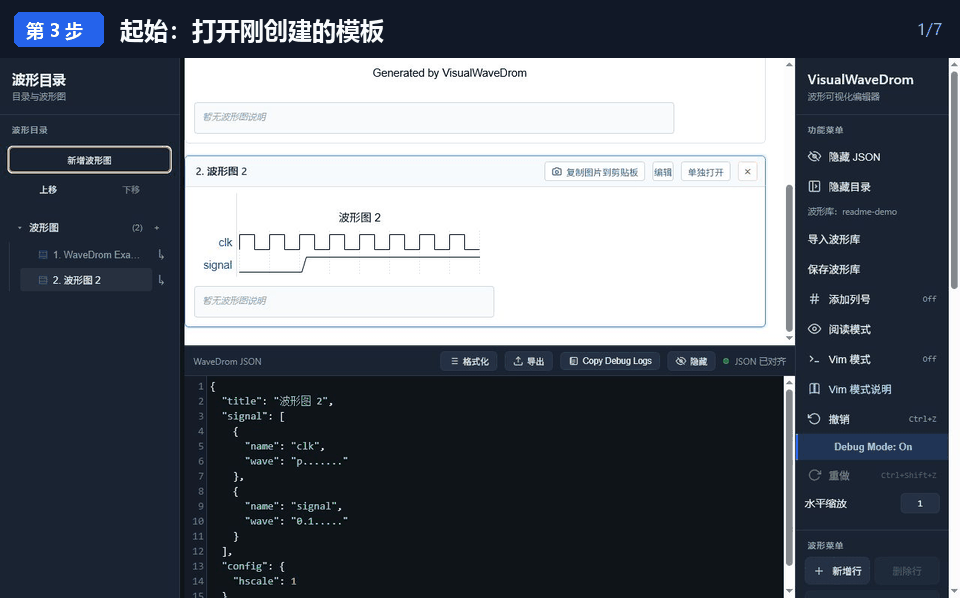
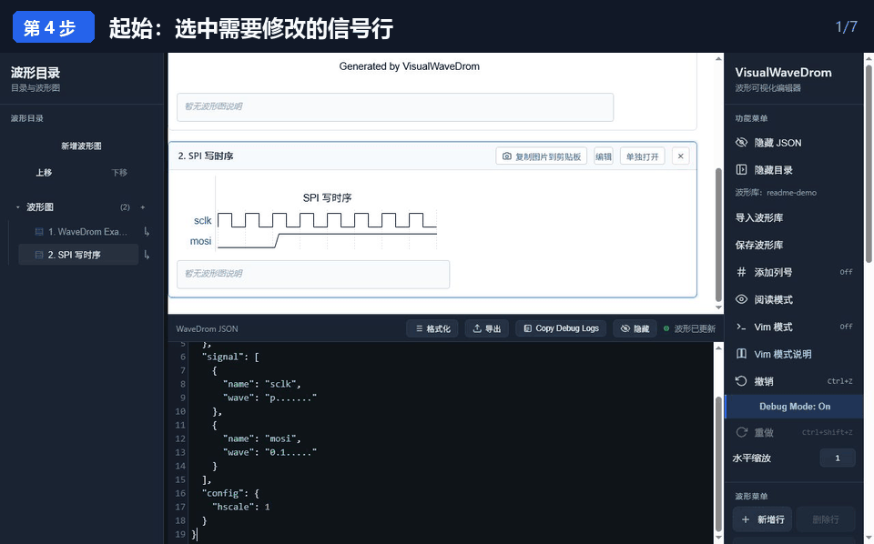
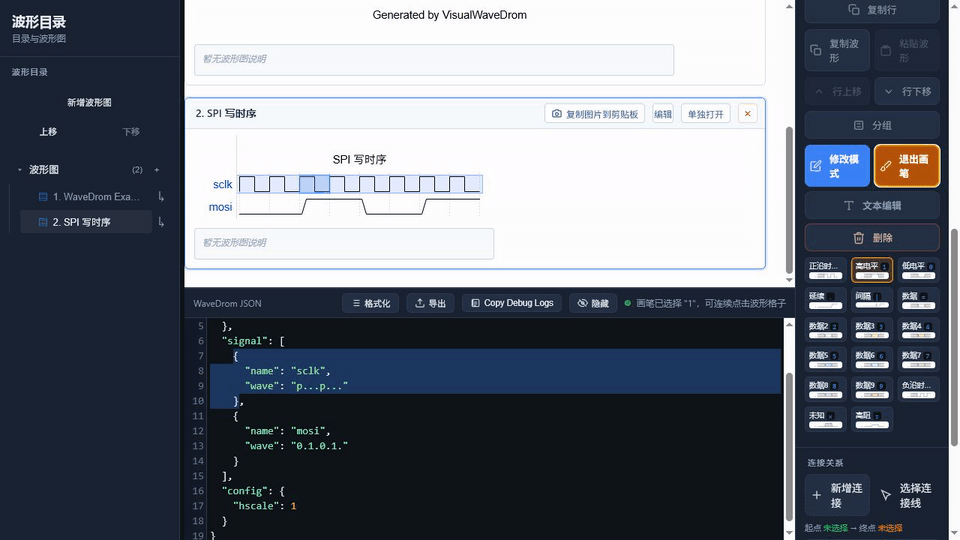
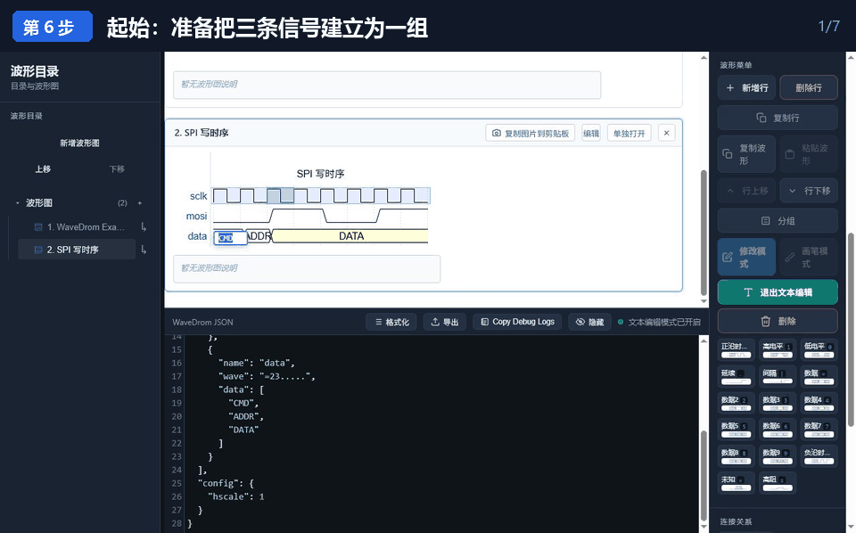
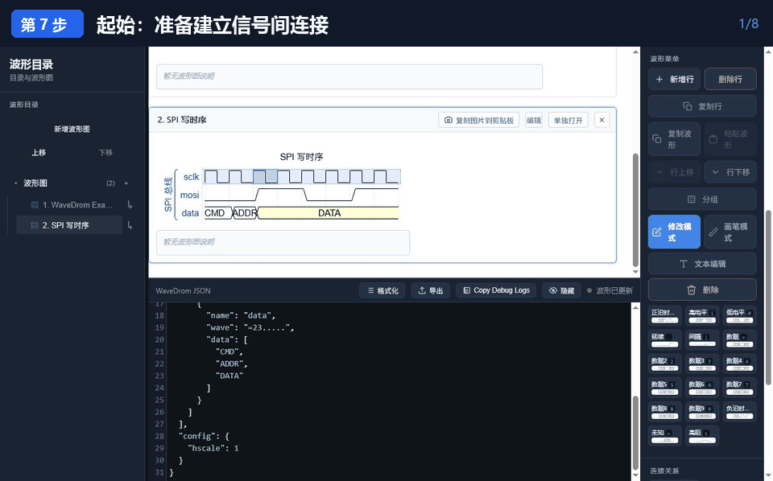
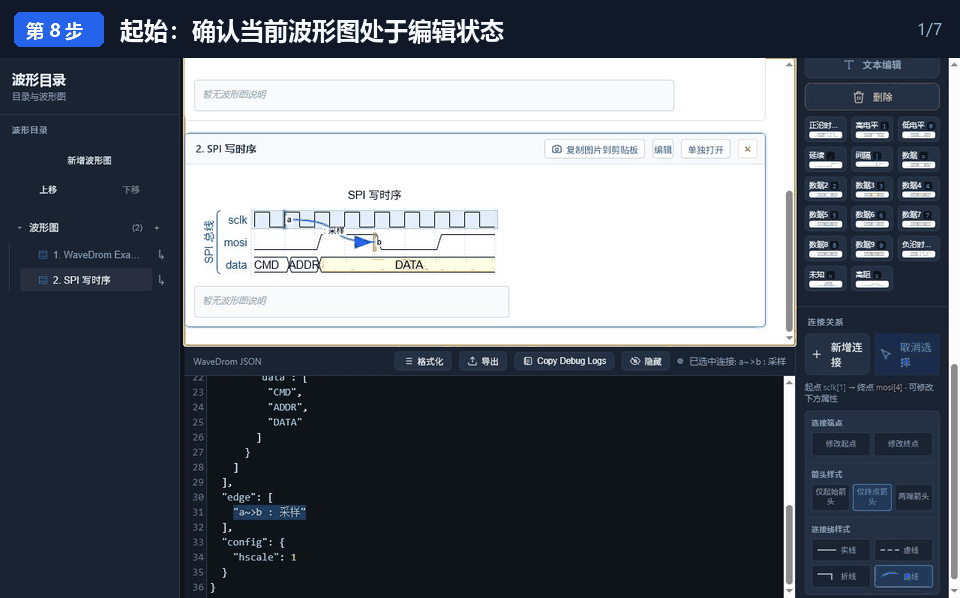
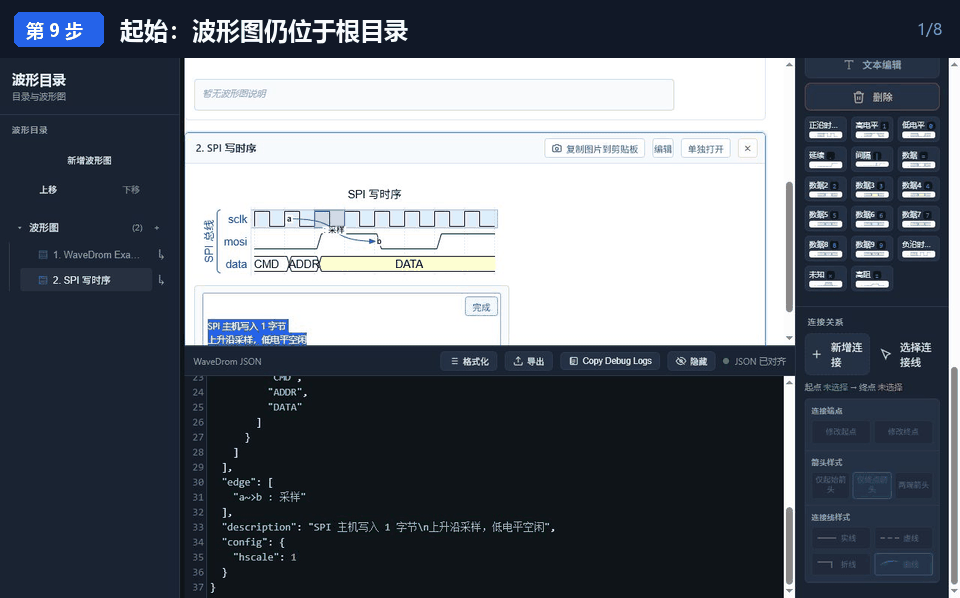
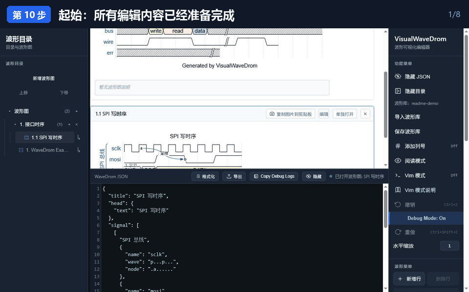

<a id="manual"></a>
# VisualWaveDrom 使用说明

VisualWaveDrom 用于编辑、归档和分析时序波形，并将大数据波形整理成适合评审、报告和演示的小型用例。主界面使用 WaveDrom 时序图，示波器窗口用于密集数据分析，演讲者窗口用于分步讲解；波形、目录、参数表等正式数据保存在 SQLite 波形库中。

本说明按“应用场景 → 界面 → 独立功能”组织。第一次使用可先看[应用场景](#scenarios)和[启动与保存](#start)，再跟随[十步简洁示例](#tutorial)操作。文中的按键均为默认设置；修改过快捷键后，以界面设置为准。

## 文档导航

| 章节 | 内容 |
| --- | --- |
| [1. 应用场景](#scenarios) | 根据目标选择功能，直接跳转到操作说明 |
| [2. 启动与保存](#start) | Windows、Linux、纯 HTML、波形库、草稿与备份 |
| [3. 主界面：波形目录](#directory) | 目录、编号、排序、层级、整图复制与删除 |
| [4. 主界面：时序图与工具栏](#wave-editor) | 波形、文字、分组、连接线、推理填充、截图 |
| [5. WaveDrom JSON 面板](#json-panel) | 显示范围、代码编辑、格式化、错误定位 |
| [6. 参数目录与参数表](#parameters) | 参数编辑、公式、筛选、引用跳转、单独打开 |
| [7. 参数链接与比较卡片](#parameter-dialogs) | 表优先级、链接预设、差异比较与编辑 |
| [8. 导入波形数据窗口](#import-single) | 单文件、序号、复数、表格导入 |
| [9. 导入波形数据预设集合窗口](#import-batch) | 文件搜索、配置、筛选、公式、预览与保存 |
| [10. 示波器窗口](#scope) | 总线、模拟、游标、缩放、公式、多波形、展示实例 |
| [11. 演讲者窗口](#presenter) | 步骤、标注、聚焦、分屏、备注、图片与 GIF |
| [12. 设置与快捷键](#settings) | 字号、键盘、Vim、本机版本同步 |
| [13. 简洁示例](#tutorial) | 从初始模板制作 SPI 时序图，每步配 GIF |
| [14. 文件与扩展](#files) | 目录结构、自定义文件解析、开发者发布 |
| [15. 常见问题与调试](#troubleshooting) | 保存、链接、导入、显示、性能、调试日志 |

<a id="scenarios"></a>
## 1. 应用场景

<a id="scenario-draw"></a>
### 1.1 画协议、接口或控制逻辑时序

**什么时候用：** 需要描述时钟、使能、数据、握手关系，重点是少量周期内的行为，而不是查看几十万个原始采样点。

**推荐流程：** [新建波形图](#directory-new-wave) → [修改标题和信号名](#wave-titles) → [画笔绘制](#wave-brush) → [编辑数据文字](#wave-data-labels) → [建立分组](#wave-groups) → [添加连接线](#edge-create) → [填写说明](#wave-description)。已有连续编号数据时，可用[拖拽推理填充](#wave-fill)批量生成标签。

第一次画图可直接按[简洁示例](#tutorial)完成一张 SPI 时序图。

图中用 `|` 省略时间、需要核对真实时序时，使用[时延检查与展开](#wave-timing-check)，由连接标签和参数推算间隔长度，并定位冲突或信息不足的行。

<a id="scenario-library"></a>
### 1.2 归档多个工程、模块或测试场景

**什么时候用：** 一张图不够，需要按工程、模块、功能或测试场景管理多张图，并在复制工程到其他电脑后继续使用。

**推荐流程：** [建立多级目录](#directory-create) → [拖动归类和调整顺序](#directory-drag) → [复制整张波形图](#directory-copy)制作变体 → [保存 SQLite 波形库](#library-save) → [备份和共享](#library-backup)。一个目录中有多张图时，点击某张图只定位到它，不需要隐藏其余图。

<a id="scenario-parameters"></a>
### 1.3 用参数表维护可复用的时序说明

**什么时候用：** 多张图使用相同的延迟、长度、门限或配置值，希望改一次参数就更新引用文字；或需要比较两个版本的参数配置。

**推荐流程：** [建立参数表](#parameter-create) → [设置值或计算公式](#parameter-formulas) → [为波形链接参数表](#parameter-link) → 在标签中[引用参数](#parameter-reference)。公共表和场景表可用[优先级](#parameter-priority)覆盖同名参数，用[链接预设](#parameter-presets)快速切换组合。

检查影响范围使用[参数引用跳转](#parameter-jump)；检查版本差异使用[参数表比较](#parameter-compare)，确认后再[保存比较修改](#parameter-compare-save)。

<a id="scenario-import"></a>
### 1.4 导入仿真、算法或采集输出

**什么时候用：** 数据已经在 TXT、CSV、TSV 等文件中，不适合逐格画图。

**推荐流程：** 少量文件用[导入波形数据](#import-file)；每次都要导入同一批文件时用[预设集合](#batch-start)。稀疏时间索引用[序号规则](#import-sequence)，复数数据用[自动拆分 I/Q](#import-complex)，多列表格用[表头和列选择](#batch-table)，仅保留有效状态用[逐列筛选条件](#batch-filters)。

重复处理同类文件时，保存[自动识别配置](#batch-autogen)和[导入预设](#batch-save)，下一次只需选择数据目录并重新搜索。

<a id="scenario-analysis"></a>
### 1.5 分析几万列数据、异常点和时延

**什么时候用：** 需要在长序列里定位跳变、脉冲、未知值、I/Q 幅值变化或两个事件之间的距离。

**推荐流程：** [打开示波器](#scope-open) → 按信号选择[总线](#scope-bus)或[模拟](#scope-analog) → 用[全局预览和缩放](#scope-zoom)定位 → 用[A/B/C 游标](#scope-cursors)及[条件跳转](#scope-jump)搜索事件 → 用[连接线测量](#scope-connections)标出周期差。

需要计算幅度或组合信号时用[公式波形](#scope-formula)；需要比较几条模拟曲线时用[多波形叠加](#scope-multiwave)。处理大图时优先[单独打开](#wave-single-open)，JSON 使用[窗口视图](#json-ranges)。

<a id="scenario-simplify"></a>
### 1.6 将大数据简化成报告用例

**什么时候用：** 原始数据很长，但报告只需要少量能解释问题的关键点；希望保留原始记录，不直接覆盖它。

**推荐流程：** 在示波器中[框选区间](#scope-selection) → [适应选区](#scope-fit-selection) → [生成简化结果](#scope-simplify) → 必要时编辑关键点 → **保存为展示实例**。再回时序图补充[文字](#wave-data-labels)、[连接线](#edge-create)和[说明](#wave-description)，最后[复制图片](#wave-image)。

“保存为展示实例”产生另一张图；“保存修改”用于把编辑结果写回当前图，两者不要混用。

<a id="scenario-present"></a>
### 1.7 评审时逐步讲解波形

**什么时候用：** 希望保持原波形不变，通过步骤、聚焦、手绘和备注向观众解释时序关系。

**推荐流程：** [打开演讲者模式](#presenter-open) → [建立步骤](#presenter-steps) → 用[聚焦](#presenter-focus)、[箭头和矩形](#presenter-shapes)、[文字](#presenter-text)标注 → 添加[分步备注](#presenter-notes) → [保存步骤](#presenter-save)。

临时强调用[指示工具](#presenter-pointer)；对照远处的两段内容用[分屏](#presenter-split)；发送演示过程用[生成 GIF](#presenter-gif)。

<a id="scenario-report"></a>
### 1.8 将图片放入 Word 或 Markdown，并保留回溯入口

**什么时候用：** 既要在文档里展示结果，又要让读者从图片回到对应波形进行检查或修改。

**推荐流程：** 先[保存波形库](#library-save)，再选择[Word 带链接图片或 Markdown 复制格式](#wave-image)。接收者需同时获得工具和波形库，并完成[首次链接注册](#wave-links)。只发 HTML、图片或 Word 文档，不会自动携带 SQLite 波形数据。

只需要静态图片时选“仅复制图片”；带讲解标注的图片应从[演讲者截图](#presenter-image)导出。

<a id="scenario-keyboard"></a>
### 1.9 大量重复编辑，减少鼠标操作

**什么时候用：** 经常移动光标、替换一段波形、复制粘贴或调整信号行。

**推荐流程：** 轻量操作用[波形快捷键](#wave-symbol-shortcuts)、[分类循环切换 Q](#wave-classifier)和[拖拽推理填充](#wave-fill)；连续键盘操作用[Vim 模式](#vim)。默认按键不适合时，在[快捷键设置](#settings-shortcuts)中修改。

<a id="start"></a>
## 2. 启动与保存

<a id="start-windows"></a>
### 2.1 Windows 服务模式

双击项目根目录的 `VisualWaveDrom.bat`。启动器使用随工具提供的 `bin/VisualWaveDrom-server.exe`，不需要安装 Node.js、Go 或 SQLite，也不要求联网。

默认访问地址为 `http://127.0.0.1:4173/VisualWaveDrom.html`。端口被占用时会选择可用端口；同一工程的服务已经启动时会复用它。以启动窗口打印的实际地址为准。

需要更换 HTML 名称或默认库时，只修改 BAT 开头的变量，不需要重命名 BAT 或服务程序：

```bat
set "HTML_FILE_NAME=VisualWaveDrom.html"
set "WAVE_LIBRARY_RELATIVE_PATH=Wave\VisualWaveDrom-library\library.sqlite"
```

相对路径以 BAT 所在目录为基准。复制工具时保留完整的 `inc`、`bin` 和所需 `Wave` 数据。运行 `VisualWaveDrom.bat --check-runtime` 可检查文件和路径，不启动服务。

<a id="start-linux"></a>
### 2.2 Linux 服务模式

Linux x64 使用 `bin/VisualWaveDrom-server-linux-amd64`，服务程序为静态构建，不要求系统安装 Node.js、Go、SQLite 或额外的 glibc 运行库。浏览器及可选的 Python 导入环境仍由系统提供。

```bash
chmod +x VisualWaveDrom.sh
./VisualWaveDrom.sh
```

也可运行 `bash VisualWaveDrom.sh`。脚本顶部的配置为：

```bash
HTML_FILE_NAME="VisualWaveDrom.html"
WAVE_LIBRARY_RELATIVE_PATH="Wave/VisualWaveDrom-library/library.sqlite"
```

`./VisualWaveDrom.sh --check-runtime` 用于检查环境。没有图形桌面或不希望自动打开浏览器时，使用 `./VisualWaveDrom.sh --no-open`，再手动打开终端打印的地址。

自动打开浏览器会尝试系统已有的桌面打开工具。显示 Running 但未弹出浏览器时，服务可能已正常启动，不必重复启动。远程 SSH 中的 `127.0.0.1` 指远程机器，不能直接当成本机地址使用。

<a id="start-html"></a>
### 2.3 直接打开 HTML

双击 `VisualWaveDrom.html` 后，可在功能菜单点击 **导入波形库**，选择 `.sqlite` 文件。编辑结束后点击 **保存波形库**，导出更新后的 SQLite 文件。

纯 HTML 模式不会悄悄覆盖原始文件，也不能调用本机 Python、注册系统链接协议或执行跨目录版本更新。浏览器中的恢复缓存不等于已经保存到磁盘。仅复制 HTML 不够，还要保留它依赖的 `inc` 资源。

| 能力 | BAT / SH 服务模式 | 直接打开 HTML |
| --- | --- | --- |
| 编辑时序图、参数表 | 支持 | 支持 |
| 读取标准 SQLite 波形库 | 服务读取本地库 | 用户选择文件后读取 |
| 保存正式波形库 | 明确保存后写回库文件 | 导出文件，由用户保存 |
| 临时恢复 | `.tmp/operations.sqlite` | 当前浏览器的本地缓存 |
| Python 文件解析和批量文件搜索 | 支持，需可用 Python | 不支持调用本机解析服务 |
| 首次注册外部单图链接 | 支持，取决于系统桌面环境 | 不支持 |
| 本机多目录版本同步 | 支持 | 不支持 |

<a id="library-open"></a>
### 2.4 打开和切换波形库

服务启动时优先恢复最近成功使用的波形库，再按启动配置和可用库进行加载。功能菜单显示当前库文件；点击 **导入波形库** 可选择另一套库。

每套库使用自己的文件夹，例如：

```text
Wave/
  ProjectA/library.sqlite
  ProjectB/library.sqlite
```

切换前先保存需要保留的修改。波形 JSON、波形目录、参数表、归属关系等存放在 SQLite 内，不需要手工拼接多个 JSON 文件。

<a id="library-save"></a>
### 2.5 保存波形库

点击功能菜单中的 **保存波形库**，等待“正在保存”提示结束并确认保存成功。它保存整套库，不仅是 JSON 面板当前显示的一张图。

服务模式在编辑时更新临时工作副本，明确保存后才提交到正式库；纯 HTML 模式导出 SQLite 文件。保存失败时保留页面，不要刷新或关闭后再尝试找回输入。

**注意不同“保存”的对象：**

| 操作 | 实际作用 |
| --- | --- |
| 普通编辑、说明框“完成” | 更新当前工作数据，不表示已正式保存波形库 |
| 参数比较“保存修改” | 将比较草稿写回参数表，仍需保存波形库 |
| 示波器“保存修改 / 保存为展示实例” | 写回来源图或新建实例；服务模式还会提交工作库，纯 HTML 需导出库文件以长期保留 |
| 导入窗口“保存预设” | 保存文件搜索和解析配置 JSON，不保存波形库 |
| 演讲者“保存” | 保存演讲步骤；当前服务实现还会提交工作库，纯 HTML 会导出 SQLite |
| 功能菜单“保存波形库” | 将当前库正式保存到磁盘或导出文件 |

<a id="library-drafts"></a>
### 2.6 临时操作和异常恢复

服务模式使用项目下的 `.tmp/operations.sqlite` 汇总工作副本、恢复记录和运行状态，避免为每张图生成零散临时文件。不同库和会话仍有独立标识，不会因为共用文件而合并内容。

正常结束会清理当前会话的临时数据；异常退出可能保留恢复记录。SQLite 已使用的空间会被复用，不一定在关闭后立即缩小。写事务期间可能短暂出现日志文件，运行时不要删除它们。

`.tmp` 不作为共享波形库，也不应提交到版本库。需要备份的是明确保存后的 `Wave/<库名>/library.sqlite`。缓存不是代替主动保存的长期备份方案。

<a id="library-multiwindow"></a>
### 2.7 多窗口编辑与同时保存

完整界面和同一库的单图窗口共享工作数据，并使用修订检查处理保存冲突。不要把某个窗口仍显示旧内容误认为它可以无条件覆盖新版本。

如果提示内容已被其他窗口修改，保留当前输入，确认其他窗口状态后再重新加载或保存。独立打开不同图不会共享“当前选中的行、连接线、文本编辑目标”等操作状态。

<a id="library-restart"></a>
### 2.8 启动程序被误关闭后继续保存

服务模式下误关 BAT / SH 后，页面可能仍能编辑，但不能写入磁盘。保存时若出现“本地服务已关闭”，选择 **重新启动并保存**；允许浏览器打开外部程序后，页面会等待服务恢复并继续保存。

此功能依赖之前由启动器完成的协议注册。自动重启受限时，手动重新运行同一目录的启动器，保留原页面再重试保存，不要先刷新。进度等待可以取消，但取消不代表内容已经落盘。

<a id="library-backup"></a>
### 2.9 备份和共享

完成保存后，可复制单个 `library.sqlite` 作为备份；也可复制整个 `Wave` 文件夹保存多套库。SQLite 内部可以按图、按数据块读取，大 JSON 的分块不会破坏“每套波形库一个文件”的要求。

发给别人时，建议提供完整工具目录、需要的波形库，以及要复用的导入预设。原始 TXT/CSV 文件不会因为已生成波形而自动打包进工具；需要重新导入时应一并提供。外部链接另见[链接使用条件](#wave-links)。

<a id="directory"></a>
## 3. 主界面：波形目录

左侧页签可以在 **波形目录** 与 **参数目录** 之间切换。波形目录中的“标题”是分类目录，一张完整波形图才是目录中的波形项，不要与图内的信号行混淆。

<a id="directory-create"></a>
### 3.1 新增目录和子目录

点击根目录或已有目录旁的 `+`，输入名称。工具自动在名称前生成层级编号；用户只需要填写名字，不必手动维护 `1.1` 等编号。

目录可有多级子目录。目录数量标记会统计后代目录中的波形，不只统计直接子项。

<a id="directory-new-wave"></a>
### 3.2 新增波形图

点击 **新增波形图**。选中目录时在该目录中创建；未选中目录时在根目录创建。新图含初始信号模板，可立即编辑，而不是全空 JSON。

新图与目录都自动编号。改变排序或归属后，所有受影响的编号同步更新。

<a id="directory-locate"></a>
### 3.3 查看目录和定位某张图

点击目录查看其中的波形图；点击某张波形图名称，将页面定位到该图。同目录其他图仍保留显示，不因定位而重新排序或全部收起。

点击图框上的 **编辑**，高亮框表示当前编辑目标，JSON 面板随之切换。切换到另一张图前会保留刚刚编辑过的工作数据。

<a id="directory-drag"></a>
### 3.4 拖动排序和移动归属

按住目录项或波形项拖动。放到另一个目录内部可更换归属；放到某项之前或之后可调整顺序。**横线表示插入位置，目录高亮表示移入该目录。**

拖动目录时，它的子目录和波形一起移动。移动波形也可以使用该项的移动按钮，在弹出选择中直接点击目标目录名称。

<a id="directory-indent"></a>
### 3.5 使用 Tab 改变层级

目录项获得焦点后，`Tab` 用于增加层级，`Shift+Tab` 用于减少层级。目录连同所属内容一起调整，不会将里面的图留在旧位置。不能建立循环父子关系或越过根目录。

在文本输入框中，按键仍用于该输入框的编辑或焦点操作，不等同于移动目录。

<a id="directory-expand"></a>
### 3.6 全部展开和全部收起

目录栏的同一个按钮在 **全部展开 / 全部收起** 之间切换。展开或收起只影响查看状态，不改变库中的层级和排序。

<a id="directory-copy"></a>
### 3.7 复制整张波形图

在目录中选中一张图，按 `Ctrl+C`；再选中目标图或目录，按 `Ctrl+V`。复制到图时放在该图后，复制到目录时追加到该目录。

副本使用独立标识，保留波形、数据文字、分组、连接线、说明等内容。此操作与波形区域的[单元格复制](#wave-copy)不同：快捷键处理哪种对象，由当前焦点决定。整图粘贴可撤销。

<a id="directory-delete"></a>
### 3.8 删除目录或波形图

删除目录时，其下内容移到上一级；删除最上层目录后，所属波形变成根目录下的波形，不会随分类标题一起消失。

图框上的删除按钮删除整张图。误删可通过 **撤销** 恢复内容和目录位置。确认不再需要后再保存正式库。

<a id="directory-layout"></a>
### 3.9 调整目录宽度与隐藏目录

按住目录与主内容之间的分隔线拖动，可调整目录宽度。功能菜单中的 **隐藏目录 / 显示目录** 用于临时腾出显示空间，不影响目录数据。

<a id="wave-editor"></a>
## 4. 主界面：时序图与工具栏

先点击目标图的 **编辑**。以下操作针对高亮的当前图；单独打开时仅有这一张图。工具栏引起波形变化后会自动格式化对应 JSON，但仍需明确保存波形库。

<a id="wave-titles"></a>
### 4.1 图标题与信号名

进入[文本编辑模式](#wave-text-mode)后点击标题或信号名进行修改，确认后同步到 JSON。图标题在目录中也会更新。

| 字段 | 显示位置 |
| --- | --- |
| 顶层 `title` | 波形框标题和目录项名称 |
| `head.text` | 时序图内部上方的标题 |
| `foot.text` | 时序图内部下方的页脚 |
| 信号对象的 `name` | 每行左侧的信号名 |

只有 `title` 或 `head.text` 其中一个时，可同时用于图框名称和图内标题；两个都有时分别显示。修改其中一个不表示另一个字段也会被改写。

<a id="wave-row-add"></a>
### 4.2 新增空信号行

点击 **新增行**：选中了行则插在该行下方，否则追加到最后。新行是空对象 `{}`，不自动添加 `name`、`wave` 或占位波形。空行仍能被选中、命名、绘制和选择连接端点。

<a id="wave-row-copy"></a>
### 4.3 复制信号行

选中行后点击 **复制行**，副本插在其下方。复制保留波形和数据文字，但不复制连接端点 `node`，避免新行意外参与已有连接。

<a id="wave-row-move"></a>
### 4.4 上移、下移和删除信号行

点击 **行上移 / 行下移** 后输入移动行数，默认 `1`。超过可移动范围时停在第一行或最后一行。删除前确认当前选中的是行还是波形格，避免把“删除格子”与“删除整行”混淆；行操作均可撤销。

<a id="wave-selection"></a>
### 4.5 单选、多选与删除格子

单击波形位置选择一格；按住鼠标拖动可框选多列或跨行区域。选区用于替换、复制、粘贴和删除，键盘 `Del` 或 `Backspace`（退格键）删除当前选中的波形，包括第一列，支持撤销。文本输入框中退格仍只删除文字；Vim 插入模式继续按原规则删除光标左侧波形。已有自定义快捷键不会被覆盖，可在设置中调整。

短行可选择到当前图最长波形对应的后方间隔。编辑尚无内容的位置时，必要的中间缺口以未知态补齐；仅添加连接端点不会据此补波形。

<a id="wave-symbols"></a>
### 4.6 波形按钮、修改模式与插入模式

选择位置后，点击波形按钮写入对应字符。修改模式替换选区；插入模式在位置处插入，后续波形后移。

| 字符 | 用途 |
| --- | --- |
| `0`、`1` | 低电平、高电平 |
| `x`、`z` | 未知、高阻 |
| `p`、`n` | 时钟波形 |
| `.` | 延续前一个波形状态或数据段 |
| `\|` | 间隔标记 |
| `=`、`2` 到 `9` | 数据段，文字保存在 `data` 中 |

选中多列后用 `2` 到 `9` 的数据按钮替换时，替换区会合并成一个数据段，例如 `4...`，不是每列生成一个独立标签。修改延续段中的一格时，区间外原有状态尽量保持，不让一次修改无意扩散到整个延续段。

<a id="wave-brush"></a>
### 4.7 画笔模式

点击 **画笔模式**，选择要使用的波形按钮，再连续点击目标格子。每次点击后仍留在画笔模式，可继续绘制其他格子。

点击退出画笔，或切换到另一张图、JSON 区域、说明区域，会退出画笔模式。画笔修改和普通波形修改一样支持撤销。

<a id="wave-symbol-shortcuts"></a>
### 4.8 波形快捷键开关

工具栏中的 **波形快捷键** 勾选后，在波形区域按相应字符等同于点击该波形按钮。未勾选时，普通模式下不能靠字符键直接改波形。

此开关只控制非 Vim 模式；开启 Vim 后，由 Vim 的插入、替换等规则处理字符输入。文本框中的输入始终优先作为文字，不应被当作波形按钮。

<a id="wave-text-mode"></a>
### 4.9 文本编辑模式

点击 **文本编辑** 或在波形区域按 `t` 进入，再单击需要修改的标题、信号名、数据文字或分组标签。再次点击该按钮或按 `Esc` 退出。当前交互不依赖双击。

普通模式的点击用于选择，不自动打开文字框。连接线标签还有[先选中连接线](#edge-label)的要求。数据和信号名编辑一般按 `Enter` 确认、`Esc` 取消；说明框的换行规则单独见[波形说明](#wave-description)。

<a id="wave-data-labels"></a>
### 4.10 数据段与数据文字

进入文本编辑模式，单击数据段，即使它原来没有文字也可编辑。编辑框靠近所点的数据段并与时序位置对齐，短文本使用较小尺寸，长文本可继续查看和输入。

`4444` 是四个独立数据段，对应四个文字项；`4...` 是一个延续四列的数据段，只对应一个文字项。新增空标签使用空字符串，不用 `.` 作为标签占位。

数据波形及其文字作为整体移动：在它前方插入、删除、替换或粘贴波形时，原文字应继续属于原数据段。

<a id="wave-copy"></a>
### 4.11 复制、覆盖粘贴与跨图复制

选中波形后使用 **复制 / 粘贴** 按钮或 `Ctrl+C / Ctrl+V`。支持跨行、跨图复制，保留相对行列位置及数据文字，但不把目标行的信号名改成来源信号名。

粘贴是覆盖，不会先删除目标区域再移动后续内容。复制一格、粘贴到多格选区时会重复填充；复制多格时按原来的块状内容粘贴。来源与目标区域重叠时也使用复制时的快照。

粘贴 `0`、`1` 时会合并相邻同值状态，用 `.` 延续，避免连续相同电平出现多余尖角。

<a id="wave-classifier"></a>
### 4.12 波形分类器、Q 与鼠标切换

入口：**功能菜单 → 设置 → 波形分类器**。可设置分类数量，以及每一类包含的波形字符；字符在不同类别中不能重复，同一类按输入顺序循环。

顶部的 **启用波形分类器** 默认勾选，点击保存后生效，并在当前浏览器中记住开关状态。关闭后不响应 `q`、双击切换和双击长按菜单，普通波形按钮不受影响，已有分类配置也会保留。取消不保存本次设置；恢复默认会重新开启分类器。

默认分类：第一类 `2345678=`，第二类为其余全部波形字符（按波形菜单顺序为 `p10.|9nxz`）。旧版默认分类会自动更新；自行修改过的分类保持不变，也可点击恢复默认。

在波形区域只选中一个格子，按 `q` 将它变为本类别的下一个字符。例如 `2 → 3 → … → 8 → = → 2`。不会自动移动选区，也不对整个多格区域循环替换。设置保存在当前浏览器，可恢复默认；切换本身可撤销。Vim 中应在普通模式使用，插入时仍按插入规则处理按键。

鼠标双击同一个格子也会切换到分类中的下一个波形。双击时，**第二下按住约半秒**，会打开带有波形图案、名称和字符的全部波形菜单：每个分类占一列，未归类的波形放在最后一列“未分类”（没有未分类波形时不显示该列）。松开鼠标后点击菜单项，可跨分类选择任意波形。分类较多或窗口较窄时，菜单可横向滚动。长按打开菜单本身不会先修改波形。

通过分类器切换 `=23456789` 数据波形段的首格时，保留紧随其后的 `.` 延续符。例如 `2...` 切换成 `3...`，仍是一个完整的数据段。切换延续段中间的格子、非数据波形，以及工具栏替换等其他操作，保持原有逻辑。

点击菜单外部或按 `Esc`，关闭菜单并取消选区，不修改数据。菜单支持上下方向键选择、左右方向键切换分类、回车确认。未归类的波形不参与 `q` 或普通双击的循环切换，但仍可通过双击长按打开全部波形菜单。文本编辑、画笔、分组和连接选点时不触发鼠标切换。以上操作提示也可在 **设置 → 波形分类器** 中查看。

<a id="wave-fill"></a>
### 4.13 拖拽推理填充数据标签

用于将已经选中的数据标签向左或向右推演，类似表格的填充柄。

1. 退出画笔、文本编辑和连接选点等模式，在图中选中一个或多个数据波形。
2. 按住选区左下角或右下角的小手柄，向外拖出虚线区域。
3. 松开鼠标后，将推理结果写入虚线区内已有的数据段。向左拖为反向推演。
4. 按 `Esc` 可取消拖动；一次填充对应一次撤销。

**原选区必须全部属于 `2` 到 `9` 的数据波形，包含这些数据段的 `.` 延续位置。** 选区中有 `0`、`1`、`x`、`|`、`=` 或空白时，松开后会提示选择的区域必须全都是数据波形，不执行部分填充。

虚线区允许混有其他波形，但只改其中 `2` 到 `9` 数据段的文字，跳过其余格子；不会把未知态、空白或普通电平自动变成数据段。`4...` 整体只算一个数据项，来源数据段不会被改写。

| 原选区标签 | 向右推理示例 |
| --- | --- |
| `5` | `5, 5, 5`，单个纯数值重复 |
| `1, 3` | `5, 7, 9`，等差递增 |
| `1.0, 1.5` | `2.0, 2.5, 3.0`，保留小数精度 |
| `D01, D03` | `D05, D07, D09`，保留前缀和补零 |
| `D01` | `D02, D03, D04`，单个带编号文本递增 |
| `IDLE, BUSY` | `IDLE, BUSY, IDLE`，重复原序列 |
| `1, 2, 4` | `1, 2, 4` 循环，不猜测非等差规律 |
| `{$delay}` | 按原表达式重复，不对参数计算结果递增 |

跨行选择时每行独立推理，全部来源验证通过后才应用。它是标签序列填充，不是 Excel 公式系统；没有自动日期推演等未列出的规则。

<a id="wave-groups"></a>
### 4.14 建立、编辑和删除分组

点击 **分组**，依次选择起始行和结束行，再输入名称。起止可以是同一行，未预先选中行也能开始分组。分组支持嵌套，多层分组不会将内部原有分组强行扩展为外层范围。

普通点击标签选中分组；文本编辑模式点击标签修改名字。选中后按 `Del` 或点击删除，只拆除分组标签，里面的信号行仍保留。

<a id="edge-create"></a>
### 4.15 新增连接线

点击 **新增连接** 后，在各信号行的列边界选择起点、终点。选择的是两格之间的边沿，不是格子中心。空行和短行后方的间隔也能选，范围参考当前图最长波形。

选完两点后默认建立从起点指向终点的直线，并保持新连接被选中，便于继续改样式。添加端点不为波形填充 `x`，空行不会因此增加 `name`、`wave` 字段。已有端点可被多条连接共享。

<a id="edge-select"></a>
### 4.16 选择连接线和取消选择

点击 **选择连接线**，再点击图中的线段。按钮会显示取消选择状态；再点击可清除选择。转去其他工具时也会取消当前连接选择，避免后续操作误用旧目标。

没有标签的连接同样可以通过线段选中。

<a id="edge-style"></a>
### 4.17 箭头与线条样式

选中连接后，可设置仅起点箭头、仅终点箭头或两端箭头，并选择直线、虚线、折线、曲线等样式。

重复点击支持多种形态的样式按钮，会在该类可用形态中循环。首次采用折线时优先先竖直、再水平。样式变化只改变几何形状，不应改变起点和终点。

<a id="edge-endpoints"></a>
### 4.18 修改起点和终点

选中连接后点击 **修改起点** 或 **修改终点**，再在图上选择新边沿。修改后清理没有实际连接使用的旧端点，其他连接仍使用的端点保留。

<a id="edge-label"></a>
### 4.19 编辑连接标签

先选中目标连接，再进入文本编辑模式并点击标签。也可以在波形区域直接按 `t` 打开已选中连接的标签编辑框，普通模式和 Vim 普通模式都支持。新增连接选完起点、终点后，新连接保持选中，此时按 `t` 即可输入标签，无需再点击连接或标签；即使连接尚在生成，也会在生成成功后打开对应的标签框。普通模式使用设置中的“文本编辑”快捷键，默认是 `t`；输入框和 JSON 代码区内仍正常输入文字，不会触发连接编辑。空标签也能为已选中连接添加文字；`Enter` 确认、`Esc` 取消，清空文字可删除标签而保留连接。

确认后结束本次标签编辑并清理选择目标。未选中连接时，不应借其他文本的点击打开上一次连接的编辑框。

标签中可[引用参数](#parameter-reference)。若引用结果有负数，整个连接标签标红，以突出异常或反向时差。

<a id="edge-label-move"></a>
### 4.20 移动连接标签

连接选中后，标签右下角显示移动手柄，按住拖动可调整位置。标签背后的紧凑白底一起移动，并保持位于间隔 `|` 等图形上方。

在连接跨越的信号行之间插入或删除行时，标签按实际行高修正垂直位置；更新参数值不应重置用户拖好的位置。

<a id="edge-delete"></a>
### 4.21 删除连接线

选中连接后按 `Del` 或点击删除。连接对应的孤立端点会清理；仍被其他连接使用的端点不会删除。删除和端点修改都支持撤销。

<a id="wave-description"></a>
### 4.22 波形说明框

每张图下方都有独立的说明框，位于波形及 `foot` 文字之后。它使用与 `signal` 并列的顶层 `description`，不是给每个信号行增加 `describe`。

只有当前处于编辑状态的图可以编辑说明。点击哪里，就从相应文字位置开始编辑，不默认全选。`Enter` 表示换行；点击 **完成** 或说明框外部，保留修改并退出编辑。

说明保持多行显示，说明框与上方波形分别横向滚动。鼠标位于可滚动的说明框内时优先滚动说明，其余位置滚动外部内容。

<a id="wave-ticks"></a>
### 4.23 添加列号：Tick 与 Tock

功能菜单的 **添加列号** 按 `Off → Tick → Tock → Off` 循环。`Tick` 对应 `head.tick`，在边界显示编号；`Tock` 对应 `head.tock`，在列中部显示编号。

首次启用默认从 `0` 开始，切换时保留已有起始编号。可在 JSON 中调整起始值，也可撤销此操作。

<a id="wave-scroll"></a>
### 4.24 滚动、冻结名称和大图定位

波形超宽时，可用横向滚动条或 `Shift+滚轮` 横向浏览，左侧信号名和分组保持冻结显示。上方波形与下方说明各用自己的横向滚动位置。

大波形采用窗口渲染，使用列位置输入和导航控制跳到目标范围，不必把整张 SVG 一次绘制出来。输入应处于有效列范围，超过范围时按界面校正结果查看。鼠标悬停波形可查看该位置内容。

<a id="wave-undo"></a>
### 4.25 撤销和重做

使用工具栏按钮或 `Ctrl+Z / Ctrl+Shift+Z`。波形替换、复制粘贴、推理填充、信号行、分组、连接线、目录和整图的增删移动都纳入各自编辑上下文的历史。

直接输入 JSON 也会记录编辑历史。文本框正在输入时优先使用文本自身的撤销，不要把它与整张图的操作历史混淆。撤销记录不是跨关闭会话的永久版本管理。

<a id="wave-single-open"></a>
### 4.26 单独打开某张图

点击图框上的 **单独打开**，新窗口只显示和编辑该图，与外部单图链接复用同一套界面。图很多时，这能减少无关图的显示负担。

单图窗口仍属于原波形库，不产生另一份独立图。编辑同步与保存要求见[多窗口编辑](#library-multiwindow)。加载库期间显示加载状态，确认加载完成后再操作。

<a id="wave-image"></a>
### 4.27 复制图片：Word 与 Markdown

点击图框上的 **复制图片到剪贴板**，按用途选择：

| 用途 | 选择方式与结果 |
| --- | --- |
| Word 只要静态图 | 仅复制图片，得到 PNG |
| Word 图片可回到波形 | 带链接图片，包含图片和单图超链接 |
| Markdown | Markdown 对应选项，提供图片和带链接内容 |
| 手动给图片加链接 | 仅复制链接，再到目标编辑器插入超链接 |

时序图截图不包含 `description`。截图列数小于 200 时直接处理；大范围截图会要求确认起止列，并优先填写当前可见范围。信号名也包含在截图内。

不同浏览器和 Word/Markdown 编辑器支持的剪贴板格式不同。Markdown 编辑器是否自动保存图片文件、是否保留外层链接，由目标编辑器决定；不能保证每种软件都“一次粘贴完成”。不支持时用 PNG 下载和仅复制链接组合完成。Word 带链接格式失败时，可按弹窗提示使用兼容复制。

<a id="wave-links"></a>
### 4.28 图片超链接与新电脑首次使用

链接记录波形库及图的标识，通过已注册的本地协议打开相应工程和单图页面，不是把波形数据塞进 Word 图片里。

新电脑首次使用前，应在该电脑运行对应工具目录的 BAT / SH，完成当前用户的协议注册；浏览器或 Office 还可能要求允许打开外部程序。悬停提示会提醒接收者先运行启动器，但无法在协议尚未注册时绕过操作系统、保证自动弹出网页提示。

多个便携目录应保留各自库标识和相对路径，并通过对应目录启动。不要手工把链接里的库 ID 换成文件夹名字，也不要仅依靠本机某个临时端口作为可携带链接。库被移走、图被删除、接收者没有库文件或协议被安全策略禁用时，链接不能正常定位。

<a id="wave-timing-check"></a>
### 4.29 时延检查与间隔展开

当时序图用 `|` 省略了一段时间，需要核对各行是否真正对齐时，点击图框上示波器旁的 **时延检查**。独立窗口会读取当前编辑内容，根据连接标签自动推算间隔长度。窗口保持打开时，波形、标签或链接参数更新后会自动重新检查；结果计算在后台执行。

连接标签表示 **终点时间 - 起点时间**，箭头外观不改变计算方向。支持以下写法：

| 标签示例 | 含义 |
| --- | --- |
| `8`、`=8`、`时延=8 cycle` | 8 周期 |
| `延迟=20 ns` | 20 ns，需先填写周期时长 |
| `2.5 cycle`、`=-0.5` | 支持小数与有符号时延 |
| `={$delay}`、`时延={$a + $b} cycle` | 使用本图链接参数表中的参数或表达式 |

支持 s、ms、us、ns、ps；未写单位时按 cycle 处理。等号右侧必须是唯一的时延数值（或参数解析后的数值）和可选单位。`>=`、`<=`、多个含义不明的等号不会被误认为确定时延。纯文字标签不参与约束；未解析参数、缺失或重复的端点会给出无法判断的原因。

各行从共同起点计算，保留 `period` 和 `phase`。普通格及 `.` 默认占用已有的周期时长；`x` 只是数值未知，不会被从时间轴删除。`|` 的总时长需要推算，不能凭两行都出现相同值就认定它们同时发生。

同一行的连接如果框住一段相同类型、相同值的波形，且标签时延大于该段原时长，会自动将该段扩展到指定时延，后续波形随之顺延。范围按左端点包含、右端点不包含计算；`.` 继承前一个波形，数据波形还要求文字相同。例如 `wave: "0...1"`、`node: "a...b"` 配合连接 `a->b =10`，原先 4 cycle 的低电平在检查图中展开为 10 cycle，后面的高电平从 cycle 10 开始。图中标记“同值展开”，左侧显示原时长、展开时长及起止时刻。

同值展开不会修改原始 JSON，也不会因“间隔内容”选择未知态而丢失原值。跨行连接、包含不同状态或不同数据文字的区域不自动扩展；已知状态中包含 `|` 时仍按原来的间隔规则检查。多个连接共同约束同一区域时统一求解，矛盾时标记冲突，内部端点位置不能唯一确定时标记未定，不擅自分配。连接时延仍是“终点减起点”，反向连接须使用对应负时延；纯同值波形短于原时长不会强行压缩。

**未知态与省略间隔也可合并展开。** 同行连接范围内只有 `x`、延续未知态的 `.`，以及延续未知态的 `|` 时，按标签时延显示为等长的连续未知波形。例如 `wave: "x||1"`、`node: "a..b"` 和 `a->b =8`，前面的 `x||` 展开为 8 cycle 的 `x`，后面的 `1` 从 cycle 8 开始；图中标记“未知展开”。固定的 `x` 仍占本行 `period`，省略间隔需要正时长，因此标签时延必须大于该区域固定部分的总时长。区域内部已有的端点仍单独参与求解，不会因合并而丢失约束。原序列参考保留 `|`，其内部虚线位置仅用于定位，不代表各个间隔的时长已被分别确定。未提供有效连接时延时，不会凭空猜测总长度，也不会将这些未知值作为下一行自动对齐的已知状态。

**补齐优先级：连接时延 > 上一行 > 下一行 > 数据文本等差规律。** 先统一计算全部连接约束，已由连接确定的位置和相对时延不会被自动对齐覆盖。优先从上到下逐行处理，每行先完成同值区域和间隔展开，再作为相邻行的依据。对仍未定的位置，将本行非未知波形与紧邻上一行**同一原始列号在展开后的时刻**对齐；上一行不能提供时刻时，改用紧邻下一行。下一行补齐后也可继续向上传递，并重新检查受影响行，优先处理新可用的上行依据。`.` 延续的已知状态也能作为依据，之后仍按本行的 `period` 延续。对齐不是按数据值匹配，也不跳过空行查找更远的参考行。结果和间隔详情会标记“上行对齐”“下行对齐”“上下行对齐”或“连接时延”来源，并注明具体参考行。

上下行均能提供时刻时，先采用上行，但仍校验下行；如果两者不一致，或同一推算区段的多个对应列要求不一致，会明确标记**时延冲突**，列出相关行、原列号、时刻及差值，不静默覆盖。按相邻行补齐会违反连接约束或间隔时长要求时同样报冲突；依赖冲突行推算的行也会标记异常。冲突时保留的绘图位置仅供定位，不能作为有效对齐结论。上下行都未定时仍为“无法判断”，不会让两行互相引用来猜出时刻。

**数据文本等差补全。** 对连接标签和相邻行仍不能确定的 `|`，若两侧是数据波形（`=23456789`），会检查同一段连续数据文本中已有相邻项的公差和每项宽度。例如 `wave: "22|2"`、`data: ["1", "3", "9"]`，已知相邻项 `1 → 3` 的公差为 2、每项 1 cycle，因此 `|` 补成 `5、7`，共 2 cycle，`9` 从 cycle 4 开始。详情标记“等差补全”，列出公差、项数、每项时长及补全值范围。这是依据已显示数据做的推断，不代表恢复了真实采样数据。

`.` 是前一数据的保持，不是新的数列项。例如 `wave: "2.2.|2.2."`、`data: ["1", "3", "9", "11"]` 中，每项占 2 cycle，省略的 `5、7` 也各占 2 cycle，`|` 共 4 cycle。每项实际时长还会乘以本行 `period`，`phase` 不变。补出的时刻可继续作为相邻行推算依据；已有连接时延和上下行结果不会因文本数列而被覆盖。

支持递增、递减、负数、小数、科学计数法，以及 `0x`、`0b`、`0o` 数值；只有一个数值部分且前后文字一致的标签也可识别，例如 `D[01]、D[02]、|、D[05]`，保留前后文字和数字补零。至少需要一对没有 `|` 隔开的已知相邻项来确认非零公差；仅有 `1、|、9` 不能唯一确定缺几项。已知项公差或宽度不一致、计算不出正整数项数、标签有多个数值、`|` 两端仍是同一个被 `.` 延续的数据、连续多个 `|` 无法分别分配时长时，不强行补全，仍显示未定。与连接关系或间隔时长约束矛盾时按冲突提示。

补出的数据只显示在检查预览中，不改原始 `wave`、`data`、`node` 或正式波形库。原序列参考仍保留 `|`。数量很多时缩小显示数值范围及项数，放大后显示当前窗口内的逐项数据，不分配巨大的数组；即使“间隔内容”选择未知态，已经按数列推断出的数据仍按推断值展示。若只能算出省略项数而无法确定绝对起点，详情保留推算时长，行状态仍为“无法判断”，不虚构位置。

同值段的内部原列位置与原序列参考带一致，按该段已确定的展开时长映射。例如上一行 `0...1` 的前 4 列展开为 10 cycle，原第 2 列映射到 cycle 5，原第 4 列映射到 cycle 10。下一行 `0|1` 没有连接约束时，仍对应**原第 2 列**，因此其 `1` 对齐至 cycle 5，不会为了寻找相同值改为对齐 cycle 10。再下一行按第二行已完成的展开结果继续判断。未确定时长的同值段内部、仅供展示的虚线占位不会被当作已知时刻。

相邻参考行为空、同列为 `x` / `|`、已到行尾、位置未定或存在时延冲突时，不使用该处补齐。对齐若违反任何连接约束，或会让某个间隔不再具有正时长，则拒绝该次补齐并报冲突；有误的连接标签不会被自动对齐掩盖。信息不足的部分继续显示“无法判断”和原序列参考。

空行按正常行处理，不因没有波形而报错。行尾 `|`（包括连续的行尾间隔）若后面没有波形或被连接线使用的端点，则只是末尾省略，无需算出时长，也不作异常高亮；若后面仍有波形或连接端点，则照常检查。空行中已有连接关系的真实时延冲突也不会被忽略。

例如 `wave: "0|1", node: "a.b"` 配合 `edge: ["a->b =5"]`，普通 `0` 占 1 cycle，推算出 `|` 总时长为 4 cycle，上升沿位于 5 cycle。下一行若也是 `0|1`，但没有时延连接，则其第 2 列按上一行对齐到 5 cycle，补齐的间隔同为 4 cycle；如果下一行自己的连接指定为 8 cycle，则优先按 8 cycle。若某行改为 `0||1` 并将 `b` 放在第 3 列，连接只能给出两个间隔的合计时长，且上一行不能提供中间位置时，不能平均分配，仍为“无法判断”。列号从 0 开始，行号从 1 开始。

检查结果有三种状态：**已确定 / 时延冲突 / 无法判断**；采用相邻行补齐的已确定行按来源显示为 **上行对齐 / 下行对齐 / 上下行对齐**。图像中的冲突行和相关间隔、连接用红色高亮；无法展开的时间区间用黄色虚线及 `?` 标记，无法定位时标记整行，不伪造时间位置。点击左侧逐行检查条目，预览会滚动定位至对应行并尽量居中，以蓝色实线框高亮该行（包含其原序列参考带），相关冲突行使用蓝色虚线框区分；原有红色、黄色异常提示仍保留。再次点击同一条目也能重新定位，后台重新检查不会将用户正在浏览的位置拉回。详情显示具体约束及差值；点击 **定位原图** 返回原来的波形行。相邻行对齐是自动位置推算，不等同于用户已提供连接时延。冲突行的画面仅供定位，不作为有效时序结论。`< >` 变步长语法目前会明确提示不支持，而非给出错误时间。

每行波形名左侧的**三角形**可展开或收起该行的**原序列参考**。默认只展开异常行（无法判断或时延冲突），正常行收起；空行没有原序列时不显示三角形。波形名上方的 **全部展开 / 全部收起** 共用一个按钮：未全部展开时点击展开全部，全部展开后点击收起全部。手动选择在当前检查窗口内保留，重新计算不覆盖手动开合状态。

参考带与主图使用同一个 cycle 坐标、缩放比例和横向滚动位置，保留 `period`、`phase` 和已确定的时刻，不再按各行长度独立铺满。未知间隔保留 `| ?`：若前后都有已知时刻，仅在两端之间分配绘图占位；没有后方已知时刻时，按原列宽继续显示。虚线片段的这些位置只是参考，不代表已算出实际时延，不会写回求解结果或用于游标测量。冲突行没有可靠时间结论时，参考带保留原始列宽作定位展示。点击参考波形可查看原列号，再点击“定位原图”跳到该列。**适应窗口**会包括已展开的参考尾部。

预览按实际时间展开确定的间隔，间隔内容默认延续原状态和数据文字，时钟继续振荡，也可选择未知 x；这只是展示假设，不是恢复被省略的真实数据。通过放大、缩小、适应窗口、起止时间输入框和底部横向滑条浏览；Shift+滚轮横向移动，Ctrl+滚轮缩放。选中游标 A/B 后点击或拖动时间预览设置时间，接近边沿时吸附，显示带符号的 B-A 差值。

**应用配置** 只把周期时长、容差和间隔展示方式写入本图的 `timingCheck`，支持撤销。正式保存仍需点击 **保存波形库**；检查和展开不会改写原始 `wave`、连接标签、数据文字或正式库文件，也不会生成巨大的延续符字符串。

<a id="json-panel"></a>
## 5. WaveDrom JSON 面板

<a id="json-toggle"></a>
### 5.1 显示、隐藏和切换当前图

JSON 面板默认隐藏，可从功能菜单 **显示 JSON** 打开。面板顶端的隐藏按钮可再次收起，偏好保存在当前浏览器中。

选择另一张图进行编辑后，面板显示对应 JSON。点击波形造成代码高亮，不等于将输入焦点交给 JSON；只有实际进入代码区编辑时，按键才修改代码。

<a id="json-layout"></a>
### 5.2 全屏与紧凑模式

点击 **全屏** 将面板铺满浏览器视口，再次点击或按 `Esc` 退出。**紧凑** 模式减少工具栏、字号和行间距，适合阅读较多内容。

最长波形不超过 200 列时，长行自动折行以避免横向滚动；超过 200 列时关闭紧凑折行，允许横向滚动，避免超长字符串反复布局造成卡顿。

<a id="json-ranges"></a>
### 5.3 摘要、窗口和完整 JSON

| 视图 | 用法 |
| --- | --- |
| 摘要 | 只读查看标题、说明、信号数和长度等信息 |
| 窗口 | 编辑当前 24 至 320 列的窗口数据，点击“应用窗口”合并回整张图 |
| 完整 | 按需加载全部 JSON；大文本默认只读，明确解锁后编辑 |

超过 200 列时首次打开优先使用窗口视图。窗口合并保留区间外数据和关联信息，不是把窗口当成完整图覆盖保存。修改后检查目标列范围，再应用。

<a id="json-format"></a>
### 5.4 格式化与导出 JSON

点击 **格式化** 整理缩进和代码布局；工具栏修改波形后也会自动格式化。**导出** 导出当前波形 JSON，不是包含目录、其他图和参数表的完整波形库。

要备份整套工程数据使用[保存波形库](#library-save)，不再使用旧的“保存波形”或“复制 JSON”按钮流程。

<a id="json-errors"></a>
### 5.5 语法错误和编辑历史

JSON 无法解析时，在错误行号左侧显示红色叉号，并提示原因。一张图错误不应阻止其他图显示和编辑。修正引号、逗号或括号后再继续图形操作。

直接编辑会合并频繁输入、记录撤销历史并延迟刷新波形，避免每敲一个字符重绘全部图。不要在有错误的中间状态下误认为图形已按新代码更新。

<a id="json-pairs"></a>
### 5.6 括号与引号包围选区

普通代码编辑时，先选中文本，再输入 `"`、`'`、`[`、`{` 或 `(`，会用相应的左右符号包住选区。预设集合代码区也支持此操作。

这只是输入辅助；JSON 标准仍要求键和字符串使用双引号，单引号不因此成为合法 JSON。Vim 键位启用时，以代码编辑器的 Vim 输入规则为准。

<a id="json-vim"></a>
### 5.7 JSON 区域的 Vim

开启 Vim 后，实际点击 JSON 编辑区可使用代码编辑器的 Vim 键位。摘要、未解锁的大文本等只读视图仍只读。

波形区域的 Vim 与代码区的 Vim 根据焦点分开处理：在波形上按 `w` 应移动波形光标，而不是将整份 JSON 替换成字母 `w`。波形命令见[Vim 说明](#vim)。

<a id="parameters"></a>
## 6. 参数目录与参数表

<a id="parameter-create"></a>
### 6.1 建立目录和参数表

切换左侧 **参数目录**，创建分类目录及参数表。目录支持多级分类与拖动整理。每个参数表固定三列：变量名 `name`、变量值 `val`、变量说明 `description`。

点击参数表标题本身即可改名，无需单独的改名按钮。参数表属于当前 SQLite 波形库，最终统一使用 **保存波形库** 保存。

<a id="parameter-rows"></a>
### 6.2 新增变量、编辑单元格和调整行序

点击 **新增变量**，在卡片中填写新增数量，允许 1 至 1000 行。点击单元格编辑，离开输入框时才将本次内容提交给参数表，不会每次按键都更新目录和所有引用图。

变量名在同一张表中应唯一，不能包含空格或 `{`、`}`、`$` 等引用语法符号。按住行的拖动位置可改变顺序；不同参数表可以包含同名变量，由链接优先级决定使用哪一项。

<a id="parameter-delete-undo"></a>
### 6.3 删除和撤销

先选中参数行，再点击上方工具栏的删除图标，或在非文字输入状态按 `Del`。修改参数值、新增或删除行、新增或删除参数表都支持撤销和重做。

正在输入时，`Del` 删除的是输入框内文字，不是整行。离开输入框后再执行行级操作。

<a id="parameter-copy"></a>
### 6.4 复制参数表与参数行

在目录选中参数表，`Ctrl+C / Ctrl+V` 复制粘贴整表；在表格区域选中一行，同样的快捷键复制粘贴参数行。行工具栏也提供复制和粘贴入口。

粘贴行放在当前行后，无选中行时追加。遇到变量重名会生成不重复的副本名称，不直接覆盖原参数。输入框内仍保留普通文字复制粘贴行为。

<a id="parameter-filter"></a>
### 6.5 变量名和变量值筛选

使用表格上方的名称和值筛选框缩小可见范围。值筛选支持 `>1`、`<0`、`>=10`、`<=100` 等比较，针对参数显示/计算后的数值筛选。

筛选只改变可见行，不删除参数，也不改变波形对这些参数的引用。

<a id="parameter-formulas"></a>
### 6.6 参数公式、常数运算、Max 与 Min

变量值可写普通文本或数值，也可写用 `{}` 包住的参数表达式：

| 写法 | 含义 |
| --- | --- |
| `{$delay}` | 引用变量，不需要额外空格 |
| `{$a + $b}` | 两个变量相加 |
| `{$a * 2 - $b / 4}` | 变量与常数进行四则运算 |
| `{1 + 2 * 3}` | 纯常数计算，结果为 7 |
| `{max($a, $b)}` | 最大值 |
| `{min($a, 10)}` | 最小值 |
| `{max(0, $a - $b)}` | 嵌套使用函数和表达式 |

变量参与运算时，运算符与相邻内容之间至少留一个空格，例如 `{$a + $b}`，不要写成 `{$a+$b}`。可用括号明确计算顺序。

**这不是 Python 公式。** `math`、`numpy` 和采样偏移属于[示波器公式](#scope-formula)，不能直接套到参数值里。

<a id="parameter-colors-errors"></a>
### 6.7 结果颜色与错误标记

编辑变量值时显示原始表达式，结束编辑后显示结果。普通值保持默认文字色，公式结果显示蓝色；负数优先显示红色，包括直接手填的负数。

某行有重名、变量找不到、循环依赖、非数值运算或除零等错误时，行前显示红叉。先查看错误原因并修正，不要把未计算成功的文字当成有效数值。

<a id="parameter-single"></a>
### 6.8 单独打开参数表

点击 **单独打开**，在独立窗口中编辑该表。它仍属于原库，使用相同的保存和冲突检查，不生成另一套参数副本。可边看参数表边查看对应时序图。

<a id="parameter-jump"></a>
### 6.9 从参数跳转到引用的波形

每行开头的跳转图标，在有图引用该参数时可点击，否则禁用。若有多张图使用，会先让用户选择目标图；跳转后高亮该图内所有相关标签，点击空白处取消高亮。

页面会优先寻找已经单独打开的同一张图，再寻找完整波形界面的标签页；不会将一张无关的单图窗口改成另一张图。没有合适页面时在当前页面定位。参数表无论是否单独打开，都使用这一逻辑。

工具会尝试唤起目标标签页；是否允许后台网页自动取得前台焦点，还取决于浏览器限制。已高亮但未前台显示时可手动切到目标页。

<a id="parameter-dialogs"></a>
## 7. 参数链接与比较卡片

<a id="parameter-link"></a>
### 7.1 为波形链接参数表

点击图框上的 **链接参数表**，勾选当前图要使用的表，可选多张。设置作用于这张图，不强制其他图使用同一组合。

保存波形库会保存所链接的参数表、顺序及所选预设信息。重新打开图时，会按链接关系替换引用值。

<a id="parameter-priority"></a>
### 7.2 拖动调整同名参数优先级

在链接卡片中拖动已加载表的上下位置。上方优先级高，遇到同名变量先使用上方表的值；高优先级表中的空值也是有效值，不自动回退到下方表。

常见配置是把“当前场景覆盖表”放上面，“工程默认参数表”放下面。

<a id="parameter-presets"></a>
### 7.3 保存和加载链接预设

在同一张卡片中，将勾选的表及其顺序保存为预设，可修改预设名或选择已有预设加载。适合多张图复用同一套参数组合。

加载预设相当于应用一组表和顺序，不是让所有图以后无条件跟随预设的任何更改。调整后检查当前图的实际勾选和排序，再保存波形库。

<a id="parameter-reference"></a>
### 7.4 在波形文字中引用参数

在标题、信号名、数据标签、连接标签或说明等支持文字的位置写 `{$name}`。运算可写 `{$a + $b}`，使用与[参数表公式](#parameter-formulas)相同的空格及函数规则。

显示状态展示计算值，编辑状态展示原始 `{$...}`。悬停引用文字可查看采用的参数表、变量值和说明。没有找到变量时保留可识别的表达式及错误提示，不静默改成 0。

负数引用会标红；连接线标签中包含负数参数时，整个标签标红。参数更新应保留用户手动调整的连接标签位置。

<a id="parameter-compare"></a>
### 7.5 选择两张表并查看差异

打开参数表的 **比较** 功能，选择左右两张表。按变量名对齐，可查看相同、不同、仅左侧、仅右侧或异常的项目，也可筛选变量名。

比较适用于检查两套场景、版本或标定配置。缺少变量的一侧不是禁止编辑的空白，可以补上对应值。

<a id="parameter-compare-edit"></a>
### 7.6 在比较结果中同时编辑两侧

点击一行的编辑入口，左右该行一起进入修改状态。点击其他行的编辑入口或空白处，会保留当前输入作为比较草稿并退出该行编辑；其他行不因当前行正在编辑而被禁用。

这些草稿尚未写回参数表，便于先修改多处再统一确认。

<a id="parameter-compare-refresh"></a>
### 7.7 更新比较结果

点击 **更新比较**，才重新计算当前草稿的差异状态。编辑时不不断重排或刷新比较列表，避免光标和行位置跳动。

<a id="parameter-compare-save"></a>
### 7.8 保存修改或放弃草稿

点击 **保存修改** 将草稿写回左右参数表；选择不保存则放弃本次比较草稿。该按钮**不会正式保存波形库**，确认结果后还需功能菜单 **保存波形库**。

如果原参数表已在其他地方变化，先处理冲突，避免用旧比较结果覆盖新内容。

<a id="import-single"></a>
## 8. 导入波形数据窗口

<a id="import-runtime"></a>
### 8.1 导入前的运行条件

文件解析使用本地服务调用 Python。请从 BAT / SH 启动，并准备可用 Python；基础解析函数兼容 Python 3.6、3.7 和 3.12，使用标准库。

查找顺序包括环境变量 `VWD_PYTHON_EXE`、工具内的 `inc/import/python-runtime`、Windows Python Launcher 或系统 `python3/python`。静态服务本身不需要 Python，但这不代表 Python 文件解析也不需要它。

<a id="import-file"></a>
### 8.2 选择文件或直接粘贴路径

入口：功能菜单中的 **导入波形数据**。

1. 选择文件，或粘贴文件完整路径并读取；Linux 上也可直接粘贴路径。
2. 查看前几行样本及自动推荐的解析方式，必要时调整预设。
3. 填写导入后的信号名，确认序号、表格等选项。
4. 查看预览，确认无误后导入完整数据。

预览只用于检查解析方式，不代表文件只导入前几行。重复导入时注意同名信号的覆盖行为，不希望覆盖时使用新的信号名。

<a id="import-sequence"></a>
### 8.3 第一列为序号与自动编号

勾选 **第一列为序号** 时，第一列必须是严格递增的非负整数，不要求连续；取消勾选时，数据按行从 0 自动编号。

有序号时，第一个序号之前没有历史值，补 `x`；两个已知序号之间的缺口延续前一个值；数据结束后不能把最后一个值无限延长到其他信号的长度。

```text
2 10
5 20
```

上例在 cycle 0、1 为未知，2、3、4 为 10，5 为 20。若文件只有一列数据，不要勾选序号；小数数据被当作序号会出现 invalid sequence number 错误。

<a id="import-complex"></a>
### 8.4 复数数据自动拆成 I/Q

检测到复数时，预览会提示，并按所填信号名生成 `<名称>_I` 与 `<名称>_Q` 两路。实部和虚部可分别显示，也可用于[幅度公式](#scope-formula)或[多波形叠加](#scope-multiwave)。

输入文件的复数写法需由所选解析器识别，先用预览检查，不要在解析失败时把未知值当成真实的 0。

<a id="import-table"></a>
### 8.5 多列 CSV、TSV 表格

表格模式按标题列名生成信号名，自动检测标题所在行；识别不对时可修改标题行号。可以只导入部分列，也可选择某列作为序号，未指定序号时自动编号。

批量预设窗口提供更完整的逐列改名、筛选和持久化配置，操作见[表格预览](#batch-table)与[筛选条件](#batch-filters)。

<a id="import-preview"></a>
### 8.6 确认导入与撤销

预览检查名称、起始位置、未知区间和数值格式后，再点击确认。完整解析完成后更新当前波形，已有数据与文字保持绑定；同名目标按导入规则更新，其余目标新增。

导入后的工作数据可撤销。最终保留仍需 **保存波形库**；导入成功不等于原 TXT/CSV 文件也被存进 SQLite。

<a id="import-batch"></a>
## 9. 导入波形数据预设集合窗口

用于反复导入多份文件，并保存搜索规则、解析选择、列筛选和派生公式。

<a id="batch-start"></a>
### 9.1 打开窗口和恢复上次选择

入口：波形菜单中的 **导入波形数据预设集合**。选择数据根目录和预设 JSON；再次打开时默认使用上次的数据目录及预设路径。

支持直接粘贴路径。选择新的预设文件后，应同时看到路径和编辑器内容更新，确认这两处指向同一份配置后再搜索。

<a id="batch-discovery"></a>
### 9.2 搜索预设文件

设置预设搜索目录，点击 **搜索预设**。程序递归查找带有以下标记的 JSON，并按相对于搜索目录的路径列出，选择一项即可载入：

```json
{
  "InnerType": "VisualWaveDrom.BatchWaveImportPreset",
  "paths": []
}
```

手动指定文件时不强制要求 `InnerType`；保存预设时自动添加它。它用于识别文件类型，不需要作为普通参数操作。

**两种搜索不同：** 搜索预设会递归子目录；按 `usrGen.folder` 搜索数据文件只查指定目录，不递归子目录。

<a id="batch-schema"></a>
### 9.3 预设结构：UsrGen 与 AutoGen

通常只需编写 `paths` 中的 `usrGen`，识别和预览后由程序补充 `autoGen`：

```json
{
  "paths": [
    {
      "usrGen": {
        "folder": ".",
        "grepKeys": "^SeqConvOutC{idx}.*\\.txt$",
        "name": "SeqConvOutC_{idx}"
      },
      "autoGen": {}
    },
    {
      "usrGen": {
        "folder": ".",
        "grepKeys": "^capture.*\\.csv$"
      },
      "autoGen": {}
    }
  ]
}
```

| 字段 | 用途 |
| --- | --- |
| `usrGen.folder` | 数据根目录加上此相对路径，得到搜索目录；`.` 表示根目录本身 |
| `usrGen.grepKeys` | 文件名匹配表达式 |
| `usrGen.name` | 单信号导入后的名称，支持变量；表格可使用各列标题 |
| `usrGen.tbl` | 可选的数值显示映射 |
| `usrGen.formula` | 可选的公式波形，不需要匹配文件 |
| `usrGen.multiWave` | 可选的多波形叠加引用 |
| `autoGen` | 检测结果和用户在预览中确认的解析配置 |

可从 [example.json](inc/import/SchemeCollection/example.json) 开始修改。数据目录不能通过 `folder` 越界到所选根目录之外。

<a id="batch-regex"></a>
### 9.4 Python 正则与自动变量

`grepKeys` 使用 Python `re` 语法。直接写 `SeqConvOutC{idx}`，不用 `${idx}`，也不用自己加 `f` 前缀。程序提取 `{idx}` 等变量并在窗口中生成输入框，空值按 `0` 处理。

例如 `^A\\d{2}_{idx}\\.txt$` 中，`{2}` 是正则量词，`{idx}` 才是变量。注意 JSON 字符串里的反斜杠需转义；在 JSON 中应写 `"^A\\d{2}_{idx}\\.txt$"`。

填入的变量值按普通文本匹配，不作为用户追加的正则代码。`vars` 是兼容字段，通常无需手填；使用不到的变量会自动删减，避免保留过期输入项。

<a id="batch-search"></a>
### 9.5 搜索结果与状态图标

点击 **搜索** 后，先匹配文件并读取少量样本，不立即完整导入。编辑器行号和左侧规则导航会显示结果：

| 状态 | 含义与处理 |
| --- | --- |
| 绿色勾号 | 匹配到一个文件 |
| 黄色感叹号 | 匹配多个文件，默认取相对路径排序后的第一个，请核对 |
| 红色感叹号 | 没有匹配文件，该项可跳过 |
| 红色叉号 | JSON 或公式等错误，查看提示原因 |

未匹配的规则不会阻止其他有效文件导入。导入信号名重复会明确提示重名，不统一报成“搜索失败”。

<a id="batch-editor"></a>
### 9.6 预设代码编辑、导航和语法错误

代码区显示行号，左侧按 `name` 生成规则导航；点击名称跳到对应字典，状态图标也同步显示在导航中。

即使载入的 JSON 有语法错误，也保留文本供修改，并在出错行号标红叉。普通输入支持撤销、重做，以及[括号包围选区](#json-pairs)。修正语法后重新搜索，以免使用旧结果。

<a id="batch-file-preview"></a>
### 9.7 展开单文件内容与总行数

单信号匹配结果有 **展开 / 收起** 按钮，展开后显示文件总行数，默认从第 1 行显示 5 行。可在文本框里改起始行和显示行数，不必导入后才检查源数据。

**第一列为序号** 的勾选结果同步到 `autoGen.hasSeq`，解析预览按选择更新。切换此选项会改变数据解释方式，应重新检查预览后再确认导入。

<a id="batch-table"></a>
### 9.8 表格预览、标题行、列选择与改名

匹配到表格后展开预览。标题行自动检测，用户可改为实际行号；各列可勾选是否导入，并单独修改信号名。复数列同样可拆分成 I/Q。

“筛选列名”只是从很多列中快速找到要配置的列，不筛掉数据记录。真正的数据条件应填在每列对应的条件框。

<a id="batch-index-column"></a>
### 9.9 指定表格序号列

从列选择中指定一列作为序号，也可不选。指定后该列用于定位，不再额外生成同名信号，内容必须为严格递增的非负整数。

无序号列时，筛选后保留的数据重新从 0 连续编号；有序号列时保留原时间位置，缺口按[序号规则](#import-sequence)处理。不要把“只有 4 条有效数据”误当成必须保留原始 12 行的长度。

<a id="batch-filters"></a>
### 9.10 为每个信号列填写筛选条件

每列可填写 `=`、`==`、`!=`、`>`、`>=`、`<`、`<=` 条件，用 `&&`、`||` 组合。例如 `CurSt` 的条件 `>=1&&<=2` 只保留状态在 1 至 2 之间的记录。

多列都设条件时，按同时满足各列条件保留整行。控制列即使不勾选导入，也可用于筛选。点击应用并检查预览，确认记录数和索引符合预期。

<a id="batch-autogen"></a>
### 9.11 自动生成配置与表格结构变化

预览中的选择记录在 `autoGen`，保存预设时一同保存；下次载入先参考这些配置，再对照实际文件。

示例为一条完整规则；通常让程序生成 `autoGen`，不必手工填写 `schemaHash` 等检测信息：

```json
{
  "usrGen": {
    "folder": ".",
    "grepKeys": "^capture\\.csv$"
  },
  "autoGen": {
    "importMode": "table",
    "headerRow": 2,
    "indexColumn": "Sample",
    "delimiter": "comma",
    "parser": "parse_table_data",
    "columns": [
      { "source": "Sample", "enabled": false, "name": "Sample" },
      { "source": "rx_I", "enabled": true, "name": "feedback_I" },
      { "source": "rx_Q", "enabled": true, "name": "feedback_Q" },
      { "source": "CurSt", "enabled": false, "name": "CurSt", "filter": ">=1&&<=2" }
    ]
  }
}
```

再次搜索时按 `source` 合并列配置：仍存在的列保留改名、勾选和条件，消失的列移除，新增列建立默认规则，不全部重写。如果原序号列消失，会撤销该列的序号配置并恢复自动编号，请检查预览。

<a id="batch-tbl"></a>
### 9.12 Tbl 显示映射

在 `usrGen` 中加入 `tbl`：

```json
{
  "usrGen": {
    "folder": ".",
    "grepKeys": "^state\\.txt$",
    "name": "state",
    "tbl": { "0": "idle", "1": "active", "2": "done" }
  },
  "autoGen": { "hasSeq": false }
}
```

原始值 1 显示为 `1:active`，示波器总线也会显示映射。JSON 字典的键必须是带引号的字符串；程序可将数值 1 与键 `"1"` 对应。未列出的值保持原样，映射不改变样本的实际数值。

<a id="batch-formula"></a>
### 9.13 导入公式波形

公式放在 `usrGen.formula`，与 `name` 同级。填写 `cycle0`、`cycle05` 的一个或两个即可，不需要手写依赖库列表。

```json
{
  "usrGen": {
    "name": "Magnitude",
    "formula": {
      "cycle0": "numpy.abs({rx_I} + 1j * {rx_Q})"
    }
  },
  "autoGen": {}
}
```

上述对象是 `paths` 列表的一项，依赖名须对应当前可用或本次导入生成的信号。复数文件拆出的名字带 `_I`、`_Q`，引用时需一致。

公式错误在导航标红叉，悬停显示原因；该公式项跳过，其他有效波形仍可导入。语法、偏移和未知值规则见[示波器公式](#scope-formula)。

<a id="batch-multiwave"></a>
### 9.14 预设中的多波形叠加

使用同级 `multiWave` 引用已有信号；它用于同一行显示多条模拟曲线，不是生成一列混合原始数据：

```json
{
  "usrGen": {
    "name": "IQ overlay",
    "multiWave": ["rx_I", "rx_Q"]
  },
  "autoGen": {}
}
```

同一条规则不要同时声明 `formula` 和 `multiWave`。示波器中的图例和层级操作见[多波形](#scope-multiwave)。

<a id="batch-progress"></a>
### 9.15 确认导入、进度和取消

搜索和预览完成后，点击 **确定导入** 才解析完整文件。按钮同一行显示文件进度、已等待时间及正在计算的公式，避免只显示“所有文件已读取”却误认为全部处理完成。

点击 **取消** 可终止导入任务。已匹配文件整批解析成功后再应用，文件解析失败不留下半批导入；未匹配规则和有错误的公式按前述规则单独跳过。

同名信号会更新对应目标，包括覆盖示波器临时新建的同名波形。需要保留旧版本时，先复制整图或改名。

<a id="batch-save"></a>
### 9.16 保存预设和更改保存路径

点击 **保存预设**，保存 `usrGen`、当前 `autoGen` 和自动补充的类型标记。默认保存位置参考原预设路径；另存到新路径成功后，窗口路径也随之更新。

Linux 图形文件选择器不可用时，可按界面提示编辑路径并点击 **保存到此路径**。保存预设不保存波形库，导入结果仍需单独保存波形库。

<a id="scope"></a>
## 10. 示波器窗口

<a id="scope-open"></a>
### 10.1 打开示波器与保存边界

点击图框上的 **示波器**，单独打开密集波形视图。它适合长数据、数值分析和简化实例，不拘泥于 WaveDrom 的字符图形。

在示波器内修改属于草稿，点击 **保存修改** 才写回来源图；服务模式下这一明确保存操作也会提交工作库。纯 HTML 模式还需要导出波形库文件。关闭前注意未保存提示；用于试算的临时公式如需长期复用，应复制到导入预设并保存预设。

<a id="scope-row-add"></a>
### 10.2 新增波形和删除波形

点击 **新增波形**，在当前选中行下方新增，名称为不重复的 `Signal` 加编号，新增后自动定位到该行。新增行默认没有原始数据，可配置公式。

**删除波形** 删除当前选中行；新增、删除均支持撤销。新增多波形使用独立按钮，见[多波形叠加](#scope-multiwave)。

<a id="scope-row-edit"></a>
### 10.3 信号改名与拖动排序

点击信号名进行修改。按住左侧信号信息区拖动可调整行位置，不需要行移动卡片。行操作支持撤销；涉及公式依赖名时，修改后检查公式引用是否仍有效。

<a id="scope-collapse"></a>
### 10.4 收起行与全部展开

信号颜色方块左侧的 `-` 可收起该行波形和名称，保留窄小的 `+` 恢复入口。相邻被收起的行会把恢复按钮按顺序合并排列。

全局预览旁的 **全部展开** 恢复所有行，不删除任何信号数据。

<a id="scope-bus"></a>
### 10.5 总线显示

点击信号的显示配置入口，在卡片中选择 **总线**。可设置二进制、八进制、十进制、十六进制、位宽和有无符号位，配置与该信号绑定。

相邻同值样本合并显示，放大后仍按实际数据边界定位，不把很多不同值当成一段。`tbl` 映射可附加显示文字；未知值 `x` 不作为数值 0 显示。

<a id="scope-analog"></a>
### 10.6 模拟显示与数值类型

选择 **模拟**，再设无符号、有符号、无符号定点、有符号定点或浮点类型，以及适用的位宽、小数位。新建模拟波形默认使用浮点类型。

数值类型应与来源一致：位模式需要正确解释符号位和小数位，已经是数值的样本不应被误认为另一套位编码。未知样本保持未知，不伪造成零电平。

<a id="scope-interpolation"></a>
### 10.7 连续与离散模拟曲线

模拟配置可选 **连续** 或 **离散**，默认连续。连续模式连接相邻时刻的点；离散模式在当前 cycle 内保持水平，再在边界变化。

时钟信号按其半周期变化显示；其他没有半周期数据的信号不会因旁边有时钟而自动变成两倍采样点。

<a id="scope-row-height"></a>
### 10.8 调整模拟行高

在模拟信号行的高度调整边缘按住拖动，可增加观察细节或压缩占用空间。它只改变显示高度，不改变信号数据和时间比例。

<a id="scope-colors"></a>
### 10.9 波形颜色、行背景和选区背景

点击信号名左侧的颜色小方块，弹出预设颜色卡片，可改波形线条颜色和整行背景。

先在图中框选列范围，再使用卡片中的 **选区背景**，只给这段区域换色。颜色从预设中选择，不需要输入 RGB。背景用于标识区域，不参与公式和数据计算。

<a id="scope-selection"></a>
### 10.10 单点、选区和 C 标志

未选中 A/B 游标时，单击波形选择当前列，用长虚线及顶部 `C` 标志表示；拖动可选择一段区域，使用矩形表示，左边界作为当前位置。

左侧信号值随当前选择更新。按住顶部 `C` 标志可拖动位置，但不能像 A/B 那样拖动虚线本身。当前选择也可用于条件跳转、缩放中心和区域背景。

<a id="scope-cursors"></a>
### 10.11 A/B 游标选择、拖动与半周期

点击工具栏 A/B 按钮会选中相应游标并定位到其位置，再点可取消选择。顶部 A/B 标志也可点击切换选择；选中后点击图中的位置，会将该游标移过去。

不处于游标选中状态也可直接拖动 A/B 线或标志。游标在当前窗口外时，顶部标志停在左右边缘，点击回到真实位置，拖动则把它移入当前窗口。

游标吸附到有效时间边沿。有半周期波形时支持 `.5 cycle`；例如落在 100.5 时，半周期信号显示该半周期值，整周期信号显示 100 cycle 的值。落在两格边界时读取右侧数据。

<a id="scope-distances"></a>
### 10.12 B-A、Cur-A 与 Cur-B

`B-A` 表示 B 相对 A 的周期距离，B 在右侧为正，左侧为负。`Cur-A`、`Cur-B` 表示当前选择位置相对 A、B 的距离；选择了一段区域时以左边界计算。

这些是带方向的距离，不是旧的无符号 Δt。

<a id="scope-jump"></a>
### 10.13 变化沿、数值条件与序列跳转

选中要观察的信号，在统一的跳转条件框中填写条件，再用左右箭头寻找上一处或下一处；游标操作上下文中的键盘左右键也可跳转。

| 条件 | 寻找目标 |
| --- | --- |
| 空 | 值发生变化的边沿，考虑 `.` 延续 |
| `1` | 等于 1 的条件进入位置 |
| `>=1&&<=2` | 满足范围条件的进入边沿 |
| `>10 or <0` | 满足任一条件的进入边沿 |
| `1,2` | 相邻两个数据位置依次为 1、2 的序列 |

支持 `and`、`or`、`&&`、`||`，逗号可连接多个连续条件。普通条件跳到从不满足变为满足的边界，不是在一长段同值里逐点停靠。序列 `1,2` 不会匹配 `1,3`。

未选择 A/B 时使用当前 C 位置进行跳转。正在输入条件时，方向键先用于输入框，避免意外移动波形。

<a id="scope-zoom"></a>
### 10.14 全局预览、缩放与拖动

全局预览显示整段波形和 A/B 位置。按住预览框拖动可移动当前窗口；鼠标在预览上滚轮缩放，也可用旁边的 `+ / - / 适应窗口`。

选中 A/B 时以活动游标为缩放中心，否则参考当前 C 选择位置。中键拖动可横向浏览波形；预计算余量用于减少拖动时的空白。快速连续缩放时，过期任务会让位给最终窗口。

<a id="scope-fit-cursors"></a>
### 10.15 适应游标

点击 **适应游标**，将 A/B 之间的区间放大到主要显示范围。先放置两个不同位置的游标，可快速比较两个事件之间的细节。

<a id="scope-fit-selection"></a>
### 10.16 适应选区

先框选一段波形，再点击 **适应选区** 或按 `z`，将显示范围调整为该选区。没有区间选区时会短暂提示“请选中一段波形”，不会任意改变视图。

<a id="scope-connections"></a>
### 10.17 连接线测量与删除

点击 **连接线**，依次选起点和终点，标签显示两点间的 cycle 数。每个端点按其所在信号的粒度选择：半周期信号允许半周期，整周期信号只允许整周期。

选中连接后按 `Del` 删除；新增和删除均支持撤销。它用于示波器里的测量标记，与主时序图中自由设置样式的连接线入口不同。

<a id="scope-formula"></a>
### 10.18 公式波形的语法和计算

在波形配置卡片选择 **公式**，使用 `0 cycle` 与 `0.5 cycle` 两个代码框。一个或两个都可填写，只写一侧时另一侧由已给出的值补充。

公式采用受支持的 Python 风格表达式，信号名用 `{}` 包围；不是任意 Python 脚本执行入口。

| 写法 | 含义 |
| --- | --- |
| `{rx_I}` | 当前时刻的 rx_I |
| `{rx_I}[0]` 或 `{rx_I}[]` | 同上 |
| `{rx_I}[-0.5]` | 前半个周期的值 |
| `{rx_I}[2]` | 后两个周期的值 |
| `{self}[-1]` | 自身前一个周期，须考虑初值是否已知 |
| `math.sqrt({I} * {I} + {Q} * {Q})` | I/Q 幅度示例 |
| `numpy.abs({I} + 1j * {Q})` | 复数取模示例 |

偏移以 0.5 cycle 为最小单位。访问范围外或未知值会得到 `x`，例如首点引用自身过去值但没有初值，后续可能一直未知。相互依赖的公式循环会报错并给出原因，不静默无限计算。

支持的依赖包括 `math`、`cmath`、`numpy` 中已适配的运算，依赖由表达式识别；具体可用函数以当前公式校验结果为准，不意味着安装了任意 Python 库都能直接调用。

<a id="scope-formula-edit"></a>
### 10.19 插入变量、应用公式和代码预览

依赖区下方点击 **插入变量**，选择已有信号，将带 `{}` 的引用插到公式光标处。有效变量会高亮，编辑错误显示原因。

公式文本输入后点击 **应用** 才校验并生效，避免输入过程中反复计算打断光标。总线/模拟数据类型等非公式显示设置仍即时生效。

可展开转换后的 Python 代码和公式 JSON 预览；卡片内容过长时在卡片内纵向滚动。**复制 JSON** 复制对应预设片段，可作为 `paths` 的一项，见[预设公式](#batch-formula)。只在示波器里新建的临时公式不是已经保存的预设文件。

<a id="scope-multiwave"></a>
### 10.20 多波形叠加与图例顺序

点击 **新增多波形**，配置要叠加的现成信号，默认名称以 `multiWave` 为基础。该行只使用模拟显示，可把多路信号绘制在同一坐标行内。

左侧图例纵向排列。点击图例显示或隐藏对应曲线；悬停会加粗并置顶强调；按住拖动图例改变层级，越靠上越晚遮挡其他曲线、越容易被看见。隐藏图例不删除源信号。

需要复用时将 `usrGen.multiWave` 保存到[导入预设](#batch-multiwave)。

<a id="scope-simplify"></a>
### 10.21 简化数据与生成展示实例

在简化区设置起止范围、目标点数和方法。可按需求选择保留事件与峰谷、跳变优先、均匀采样或趋势保留等方式，先生成结果再检查关键点。

需要时对结果点进行修改、插入或删除。**保存为展示实例** 新建一张用于说明的波形，不破坏原始图；**保存修改** 则写回当前来源图，简化结果覆盖前应仔细确认。

缩小显示时的绘制抽样不等于数据已经被简化。只有明确生成并保存简化结果，才改变保存的展示数据。

<a id="scope-undo"></a>
### 10.22 撤销、计算等待和未知值排查

新增/删除/移动行、编辑点、连接线等支持示波器内撤销。重算期间等待状态结束，再判断结果；不要用绘图尚未完成的短暂空白代替实际数据检查。

公式全为 `x` 时先核对依赖名称、数据长度、时间偏移和类型，再查看公式错误信息。总线有数值而模拟显示异常时，检查数值类型及位宽，不要先改掉原始文件。

<a id="presenter"></a>
## 11. 演讲者窗口

<a id="presenter-open"></a>
### 11.1 打开、复用窗口与同步原图

点击图框上示波器旁的 **演讲者模式**。同一库的同一张图复用一个演讲窗口，不重复打开；不同图可分别打开。

主界面修改波形后，演讲图会同步更新，批注以波形行列位置为依据保留。演讲标注不直接修改信号样本；如果对源图做大范围重排，仍应核对原有标注是否符合新的讲解内容。

<a id="presenter-steps"></a>
### 11.2 演讲步骤、步骤文字与切换

使用 **上一步 / 下一步 / 新增步骤** 组织讲解过程。顶端的步骤文字可直接点击修改，`Enter` 或点击别处确认，`Esc` 取消。

每个步骤可保存自己的文字、批注、聚焦、游标和画面位置。新增步骤使用默认步骤文字，并复制当前步骤的讲解备注，之后独立编辑。

<a id="presenter-pointer"></a>
### 11.3 指示红圈与临时线

选中 **指示**，红圈跟随鼠标，单击产生震荡提示。按住拖动可画临时线；设置中可选择下一次单击清除，或双击清除。

默认单击清除时，下一次点击或开始拖动画线会清掉上一笔；双击清除时可保留多笔直到双击。退出指示、切换步骤或按 `Esc` 也会清除。

临时线用于现场强调，不进入正式批注历史、不保存到步骤，也不进入截图和 GIF。需要长期保留用[画笔](#presenter-pen)。

<a id="presenter-pen"></a>
### 11.4 画笔与颜色

选中 **画笔**，选择预设颜色，按住鼠标左键绘制。每次拖动是一笔，可撤销。换色只影响新笔迹，旧笔迹保留自己的颜色。

需要再次改色时打开工具旁的颜色入口。正式画笔内容可保存、截图和生成 GIF。

<a id="presenter-shapes"></a>
### 11.5 箭头、矩形与线宽

**箭头** 从按下位置指向松开位置；**多边形** 按钮当前用于拖出矩形。样式卡片提供预设颜色和 1 至 16 px 线宽。

绘图工具启用或相应图形被选中时，滚轮可调线宽；`Ctrl+滚轮` 仍用于缩放。已有箭头或矩形也可选中后调整样式。

<a id="presenter-text"></a>
### 11.6 原位添加和编辑文字

选择 **文字** 后点击图中位置，直接在图像上输入，不再打开单独文字卡片。输入区域随内容扩展，并随图像滚动和缩放。

`Enter` 换行；点击 **完成**、按 `Ctrl+Enter` 或点击别处确认；`Esc` 取消。文字字号、颜色和位置按图上实际效果保留，注意不要放到图像边界之外。

<a id="presenter-eraser"></a>
### 11.7 橡皮擦

选择 **橡皮擦**，单击或拖动擦除笔迹、箭头、矩形和文字，不擦除底层波形。误擦可撤销。

<a id="presenter-annotation-select"></a>
### 11.8 选择、移动和删除批注

取消功能工具的选中状态，单击批注选中，右下角出现移动手柄。按住手柄拖动可整体移动；直接拖动笔迹本身不当作移动批注。

重叠区域反复点击可轮流选择不同批注。`Del` 删除当前选中项，空白处或 `Esc` 取消选择。手柄和选中框不会出现在导出图片中。

<a id="presenter-pan"></a>
### 11.9 拖动画布与适应窗口

未选择绘图工具时，按住鼠标左键拖动画布，查看超出窗口的部分。移动画布不移动批注本身，也不产生数据修改历史。

**适应窗口** 用于恢复整体查看；全屏可扩大讲解区域。文字输入框、备注和滚动条保留自己的操作，不抢用为画布拖动。

<a id="presenter-focus"></a>
### 11.10 聚焦多行、多列或矩形

点击 **聚焦**，在小卡片中选择多行、多列或矩形，再拖出目标范围。选区有边框，外部区域淡化。

切换到画笔等工具后聚焦可保留；再次取消聚焦按钮，或按 `Esc` 清除。聚焦范围还可用于[局部截图](#presenter-image)。

<a id="presenter-cursors"></a>
### 11.11 游标 A 与游标 B

使用 **游标A / 游标B** 按钮选择对应游标，再点已选按钮取消选择但保留位置。可用它们辅助说明起止时刻和时间间隔，位置随步骤保存。

示波器的条件搜索属于另一套分析功能，不在这里执行。

<a id="presenter-notes"></a>
### 11.12 每步讲解备注

讲解备注随步骤切换，切换前保留当前输入。第一步可用图的 `description` 初始化；新增步骤复制上一步备注，后续各自修改，源图说明更新不会强行覆盖已写备注。

备注用于讲解者阅读，不包含在截图和 GIF 中。

<a id="presenter-notes-popout"></a>
### 11.13 备注悬浮窗与恢复

点击备注区的悬浮窗图标，将备注移到独立窗口。支持时使用浏览器提供的置顶窗口能力，否则使用普通弹窗。

点击 **恢复备注** 或关闭小窗口，可回到原页面，保留内容、选区和滚动位置。若被拦截，需要允许此页面弹窗；浏览器不支持时不能保证始终置顶。

<a id="presenter-split"></a>
### 11.14 上下分屏与左右分屏

入口：演讲者 **设置 → 分屏**，同一入口切换布局。

| 布局 | 独立滚动 | 同步滚动 |
| --- | --- | --- |
| 上下分屏 | 上下方向独立，可对照不同信号行 | 左右方向同步，保持相同时间范围 |
| 左右分屏 | 左右方向独立，可对照不同时间片段 | 上下方向同步，保持相同行位置 |

两个区域查看同一张图和标注，不是复制出两套独立数据。退出分屏不会删除批注。

<a id="presenter-image"></a>
### 11.15 复制整图或聚焦区域图片

点击 **复制图片**，选择 **整张图片** 或 **仅聚焦区域**。局部截图自动带上对应信号名和正式批注，包含箭头、文字、画笔及游标，不带工具栏、讲解备注、`description` 和超链接。

图片剪贴板不可用时回退为 PNG 下载。超大图整图生成有尺寸和数据量保护，遇到提示改用聚焦区域，不会静默截掉后半张图。

<a id="presenter-gif"></a>
### 11.16 按步骤生成 GIF

在 **复制图片 → 生成 GIF** 中勾选步骤，设置切换间隔，再点击 **生成并下载**。默认全选、每步 1 秒；可设置 0.1 至 60 秒，至少 2 步、最多 200 步。

步骤按原始顺序播放，不按勾选顺序。例如选择第 1、3、4 步，就按 `1 → 3 → 4` 循环。图像包含各步正式批注和聚焦效果，不包含备注或临时指示线。

生成时显示进度和等待时间，可取消并保留当前演讲状态。不同尺寸步骤会等比适配统一画布；尺寸和文件体积有保护限制，过大时减少步骤或范围。生成 GIF 不替代保存演讲步骤或波形库。

<a id="presenter-undo"></a>
### 11.17 撤销与重做

使用按钮或默认 `Ctrl+Z / Ctrl+Shift+Z`，撤销当前步骤的笔迹、图形、文字、移动、删除、擦除、聚焦及游标操作。输入框内优先处理文字撤销。

临时指示线和单纯画布平移不作为正式批注历史。

<a id="presenter-save"></a>
### 11.18 保存步骤和关闭提示

点击顶部 **保存** 或 `Ctrl+S`，保存步骤文字、备注、批注、聚焦、游标和画面位置。服务模式下此显式保存会提交工作库；纯 HTML 模式保存浏览器快照并导出包含步骤的 SQLite 文件。

点击退出时，有未保存修改则可选保存并退出、不保存或取消；保存后没有新改动则不再提示。直接关闭浏览器标签页时使用浏览器原生提醒，网页不能自定义该提醒的全部文字和按钮。

<a id="presenter-shortcuts"></a>
### 11.19 演讲者快捷键设置

入口：**设置 → 快捷键配置**。单键快捷键显示在按钮上，组合键在悬停提示中显示。输入文字时不触发这些单键命令。

| 默认键 | 功能 | 默认键 | 功能 |
| --- | --- | --- | --- |
| `1` | 指示 | `2` | 画笔 |
| `3` | 箭头 | `4` | 多边形/矩形 |
| `q` | 橡皮擦 | `w` | 文字 |
| `e` | 聚焦 | `r` | 游标 A |
| `a` | 游标 B | `s` | 上一步 |
| `d` | 下一步 | `f` | 新增步骤 |
| `z` | 适应窗口 | `x` | 讲解备注 |
| `c` | 复制图片 | `v` | 全屏 |

这些按键只作用于演讲者窗口，不要与波形分类器 `q`、示波器适应选区 `z` 混淆。

<a id="settings"></a>
## 12. 设置与快捷键

右侧边栏的 **功能菜单** 和 **波形菜单** 支持拖动标题调整布局，不再使用显示勾选框。按住菜单标题拖动，右侧栏会显示五个放置区域：拖到左侧或右侧形成左右分栏，拖到上方或下方形成上下分栏，拖到中间“分页”合并为两个页签。分页时单击页签切换菜单，也可拖动页签拆回分栏。两个菜单始终限制在右侧，拖到栏外松手或按 `Esc` 会取消移动。

分栏中的菜单分别滚动，连接关系保留在波形菜单内；浏览器会记住布局、顺序和当前页签。单击菜单标题也可打开位置选择；键盘聚焦标题后按回车可选择放置位置，分页时可用左右方向键切换页签，用 `Alt+Enter` 调整布局。参数目录中只显示功能菜单，返回波形目录后恢复原布局。窗口较窄时，左右分栏可在右侧栏内横向滚动查看。

<a id="settings-font"></a>
### 12.1 字体自动适配和手动字号

功能菜单 **设置** 中默认开启自动适配系统字号。可用滑块或数字输入将界面字体调整到 80% 至 200%，修改立即生效；恢复默认会回到自动适配和 100%。

设置影响目录、菜单、代码区等控件，不改波形数据本身。本机浏览器保存偏好，不随波形库发给别人；系统 DPI 和浏览器缩放仍由浏览器处理。

<a id="settings-shortcuts"></a>
### 12.2 自定义主界面快捷键

在设置中点击 **快捷键**，查看或修改可配置操作。出现冲突时按提示调整，确认后保存。默认文本编辑是 `t`，不再用 `Ctrl+T` 或 `F2`。

快捷键按当前区域生效：目录中的复制是整图/整表，波形中的复制是格子，输入框中的复制是文字。单独窗口也维护各自焦点，不跨窗口抢用编辑目标。

波形字符键还受[波形快捷键开关](#wave-symbol-shortcuts)控制；分类设置见[波形分类器](#wave-classifier)。

<a id="vim"></a>
### 12.3 开启 Vim 与查看说明

功能菜单 **Vim 模式** 开关启用键盘波形编辑，其下 **Vim 模式说明** 或波形区域中的 `?` 可打开内置手册。底部状态显示当前模式、数字前缀及等待输入的组合键。

先点击波形区域取得操作焦点。说明框、参数输入等普通文本框不使用波形 Vim；实际聚焦 JSON 时使用[代码编辑器 Vim](#json-vim)。

<a id="vim-motion"></a>
### 12.4 Vim 移动与选择

| 按键 | 功能 |
| --- | --- |
| `h j k l` | 左、下、上、右，支持 `5l` 等数量前缀 |
| `w / b / e` | 后一变化点、前一变化点、波形段末尾 |
| `0 / $` | 当前行的起始/结束位置 |
| `gg / G` | 起始/结束边界 |
| `v / V` | 格子选择/信号行选择 |
| 可视模式 `o` | 交换选择起止位置 |
| `Esc` | 退出当前输入或选择状态 |

光标移出可见范围时会滚动到可见位置；普通波形修改不应无故重置滚动位置。

<a id="vim-edit"></a>
### 12.5 Vim 复制、删除、替换与插入

| 按键 | 功能 |
| --- | --- |
| `y` | 复制选区；普通模式可用 `yy` 复制行 |
| `p / P` | 在相应位置粘贴 |
| `x` | 删除波形；可视模式 `d` 删除选区 |
| `dd` | 删除当前信号行 |
| `r` 后输入字符 | 一次替换，包括批量选区 |
| `R` | 连续替换，替换为相同字符也继续向后移动 |
| `i / I / A` | 当前格、行首、行末进入插入 |
| 插入模式 `Backspace / Delete` | 删除左侧/右侧波形 |
| `t` | 编辑当前数据、分组或已选连接的文字 |
| `o / O` | 当前行下方/上方插入空行 |
| `[r / ]r`，或 `K / J` | 上移/下移信号行，可配数量 |
| `u / Ctrl+r` | 撤销/重做 |
| `.` | 重复最近一次可重复修改 |

正常模式中的 `.` 是重复命令；要将波形改成延续符，使用 `r` 后输入 `.`，或在插入/替换模式输入。`|` 可作为间隔波形输入。复制行仍不复制 `node` 端点。

<a id="vim-group-edge"></a>
### 12.6 Vim 分组和连接线

可视行模式中依次按 `Space`、`g` 建立分组；`Space`、`a` 开始新增连接；`Space`、`c` 选择已有连接。选中分组或连接后可按 `d` 删除对应对象。

这些操作复用主界面的选择与撤销逻辑，不单独改变 JSON 结构规则。

<a id="vim-commands"></a>
### 12.7 Vim 命令行

按 `:` 输入命令，`:open` 后只填目录中的编号，不用输入标题：

```vim
:open 1.2
```

| 命令 | 功能 |
| --- | --- |
| `:w` | 保存波形库 |
| `:format` | 格式化当前 JSON |
| `:json` | 显示/隐藏 JSON |
| `:nav` | 显示/隐藏目录 |
| `:new` | 新建波形图 |
| `:debug` | 切换调试模式 |
| `:noh` | 清除高亮 |
| `:set vim` / `:set novim` | 开启/关闭 Vim |

<a id="settings-version"></a>
### 12.8 本机版本号和最新版本目录

工具栏顶端显示版本号。点击版本号或打开 **设置 → 版本管理**，查看当前工具目录和系统记录的最新版本目录，可指定另一个已有目录或空目录。

只比较本机副本，不联网查询 GitHub。通过 BAT / SH 启动时检查版本：

| 当前副本与记录目录比较 | 行为 |
| --- | --- |
| 版本相同 | 不询问更新 |
| 当前副本更高 | 询问是否更新系统记录目录 |
| 当前副本更低 | 询问是否从记录目录更新当前目录 |
| 记录目录为空 | 询问是否将工具复制过去 |
| 记录目录丢失或不可用 | 提示重新指定，仍可运行当前副本 |

拒绝不会自动降级或覆盖用户文件。首次运行可选择是否将当前目录记录为最新目录。

<a id="settings-history"></a>
### 12.9 查询两个版本之间的变更

更新确认窗口和版本管理页均有 **查看版本历史**。可查看两个版本之间的编号发布、说明、提交编号和提交内容，再决定是否更新。版本相同时可查看随工具提供的历史。

历史来自工具包中的 `inc/visualwavedrom-history.json`，不要求安装 Git 或联网；缺失的历史会提示未提供。查看历史本身不会开始更新。

<a id="settings-update-protection"></a>
### 12.10 更新保护与本机路径隐私

版本同步不复制或覆盖 `Wave`、用户导入预设、`.git` 等数据。已有 BAT 保留项目配置；**`VisualWaveDrom.sh` 在版本同步时忽略，不复制也不覆盖，包括空目标目录。** Linux 需要启动脚本时，请从完整工具包手动保留或提供。

目标目录仍运行服务、发布清单不完整、程序文件存在不匹配的本地修改时，会停止更新，避免悄悄覆盖。更新须用户确认。

系统记录路径属于当前系统用户，不写在波形库或项目提交中：

```text
Windows: %APPDATA%\VisualWaveDrom\tool-version.json
Linux:   ${XDG_CONFIG_HOME:-$HOME/.config}/VisualWaveDrom/tool-version.json
```

纯 HTML 只能显示版本，不能执行跨目录更新。

<a id="tutorial"></a>
## 13. 简洁示例：从模板制作 SPI 时序图

下面保留逐步骤 GIF，每步均有对应功能说明链接。GIF 为已有操作演示素材，部分按钮位置可能随版本调整，以本说明和当前界面为准；JSON 面板现在默认隐藏。

<a id="tutorial-1"></a>
### 13.1 启动工具

Windows 双击 BAT，Linux 运行 SH，等待页面和库加载。确认功能菜单显示正确库名。[启动说明](#start-windows)



[查看高清静态图](ReadMeFig/01-start-service.png)

<a id="tutorial-2"></a>
### 13.2 新增模板图

点击 **新增波形图**，得到含 `clk` 和 `signal` 的模板，选中图显示编辑高亮框。[新图说明](#directory-new-wave)



[查看高清静态图](ReadMeFig/02-new-wave-template.png)

<a id="tutorial-3"></a>
### 13.3 修改标题与信号名

进入文本编辑模式，标题改为 `SPI 写时序`，两行改名 `sclk`、`mosi`。若 JSON 同时有 `title` 和 `head.text`，按需要分别修改。[标题字段](#wave-titles)



[查看高清静态图](ReadMeFig/03-edit-title-signals.png)

<a id="tutorial-4"></a>
### 13.4 用画笔绘制时钟和数据电平

退出文本编辑，进入画笔模式，分别选择时钟、低电平、高电平和延续符绘制格子。完成后退出画笔。[画笔说明](#wave-brush)



[查看高清静态图](ReadMeFig/04-paint-waveform.png)

<a id="tutorial-5"></a>
### 13.5 增加数据段和标签

新增行，命名为 `data`，画三个数据段。进入文本编辑，分别输入 `CMD`、`ADDR`、`DATA`。[数据标签](#wave-data-labels)



[查看高清静态图](ReadMeFig/05-data-labels.png)

<a id="tutorial-6"></a>
### 13.6 给信号分组

点击分组，依次选择 `sclk` 到 `data`，名称填 `SPI 总线`。可选中标签再编辑名称，删除组不会删除信号。[分组说明](#wave-groups)



[查看高清静态图](ReadMeFig/06-group-signals.png)

<a id="tutorial-7"></a>
### 13.7 增加采样连接

新增连接，选择 `sclk` 起点边沿和 `mosi` 终点边沿，形成默认直线后按需要改成曲线。选中连接并进入文本编辑，标签填 `采样`。[连接操作](#edge-create)



[查看高清静态图](ReadMeFig/07-add-connection.png)

<a id="tutorial-8"></a>
### 13.8 添加多行说明

在当前图下方说明框输入“SPI 主机写入 1 字节”，回车，再输入“上升沿采样，低电平空闲”。点击完成。[说明框规则](#wave-description)



[查看高清静态图](ReadMeFig/08-edit-description.png)

<a id="tutorial-9"></a>
### 13.9 整理目录

用目录 `+` 建立“接口时序”，将图拖进去或通过移动按钮选择目标。目录和图的编号自动更新。[目录移动](#directory-drag)



[查看高清静态图](ReadMeFig/09-organize-directory.png)

<a id="tutorial-10"></a>
### 13.10 保存、截图和单独打开

点击 **保存波形库**，等保存成功。使用图框上的复制图片分享结果；点击单独打开，可以专注编辑这一张图。[保存](#library-save) · [截图](#wave-image) · [单图编辑](#wave-single-open)



[查看高清静态图](ReadMeFig/10-save-and-share.png)

<a id="tutorial-json"></a>
### 13.11 示例 JSON

以下为便于对照的一份完整内容；图形操作生成的节点名、扩展属性和布局信息可能不同。可粘贴到新图 JSON 面板，再点击格式化查看。

```json
{
  "title": "SPI 写时序",
  "head": { "text": "SPI 写时序" },
  "signal": [
    [
      "SPI 总线",
      { "name": "sclk", "wave": "p...p...", "node": ".a......" },
      { "name": "mosi", "wave": "0.1.0.1.", "node": "....b..." },
      { "name": "data", "wave": "234.....", "data": ["CMD", "ADDR", "DATA"] }
    ]
  ],
  "edge": ["a~>b 采样"],
  "description": "SPI 主机写入 1 字节\n上升沿采样，低电平空闲",
  "config": { "hscale": 1 }
}
```

<a id="files"></a>
## 14. 文件与扩展

<a id="files-layout"></a>
### 14.1 文件夹用途

```text
VisualWaveDrom.html                  主页面
VisualWaveDrom.bat                   Windows 启动入口
VisualWaveDrom.sh                    Linux 启动入口
bin/                                Windows/Linux x64 静态服务程序
inc/                                页面逻辑、样式、依赖和内部模块
inc/sqlite/                         纯 HTML 使用的 SQLite 资源
inc/import/Scheme/                  单文件解析预设 JSON
inc/import/SchemeCollection/        批量导入预设 JSON
inc/import/Data/                    示例原始数据
inc/import/inc/fileProc.py          Python 文件解析与统一补全
inc/server-go/                      本地服务源码
Wave/<库名>/library.sqlite          正式波形库，每库一个文件夹
.tmp/operations.sqlite              临时操作、运行状态和恢复信息
ReadMeFig/                          本说明的 GIF 与截图
tools/                              构建和维护工具
```

旧的根目录 `import`、`server-go` 已归入 `inc`。升级应使用完整工具包，不要只替换 HTML 而保留不匹配的脚本和服务程序。原始数据、预设和正式库是不同对象，备份时按用途分别保留。

<a id="files-single-scheme"></a>
### 14.2 单文件解析方案

`inc/import/Scheme` 可以保存多种 JSON 方案，供单文件导入选择。示例：

```json
{
  "version": 1,
  "name": "基础序号数据导入",
  "description": "第一列序号，第二列数据",
  "mappings": [
    {
      "file": "Data/basic-signal.txt",
      "signal": "signal",
      "parser": "parse_index_data",
      "options": { "delimiter": "auto", "encoding": "utf-8-sig" }
    }
  ]
}
```

`file` 是相对于 `inc/import` 的示例/默认文件，界面选了文件后使用实际选择；`signal` 为默认信号名，界面可覆盖。该预设中的文件路径不能使用绝对路径或越出预设允许目录，和窗口中用户主动粘贴的文件路径不是同一项限制。

内置解析器包括 `parse_index_data`、`parse_csv_index_data`、`parse_tsv_index_data`、`parse_single_column`。批量集合格式见[UsrGen / AutoGen](#batch-schema)，不要混用两种顶层结构。

<a id="files-custom-parser"></a>
### 14.3 自定义文件解析函数

Python 处理分为两步：第一步只解析文件，第二步统一补全信号。自定义格式只需在 `fileProc.py` 中增加 `parse_xxx(file_path, options=None)` 并注册到 `FILE_PARSERS`，返回点列：

```json
{
  "points": [
    { "index": 2, "value": "0" },
    { "index": 3, "value": "1" },
    { "index": 5, "value": "x" }
  ]
}
```

固定的 `complete_previous_value` 负责前方未知、离散序号延续、WaveDrom 字符与 `data` 对应等补全规则。上例基础状态可生成 `xx01.x`，用户无需重复编写补全代码。

解析器返回真实点列，不应为了预览擅自截断整份文件。保存源码使用 UTF-8，保持 Python 3.6/3.7/3.12 兼容语法；更多选项以当前解析函数定义为准。

<a id="files-release"></a>
### 14.4 开发者构建与发布版本

修改服务程序或发布新版本时，使用 `tools/BuildGoServer.ps1` 生成对应程序、版本信息和校验清单。示例版本号需替换成实际发布编号：

```powershell
powershell -ExecutionPolicy Bypass -File tools/BuildGoServer.ps1 -Version 2026.9.25.1 -ReleaseNotes "本次功能修改说明"
```

新功能版本使用更大的版本号，不只修改界面文字。历史文件根据已有发布及本地提交生成；校验清单用于本机多目录更新。不要把自己的 `Wave`、`.tmp` 或系统版本路径配置混入程序发布文件。

<a id="troubleshooting"></a>
## 15. 常见问题与调试

<a id="faq-copy-html"></a>
### 15.1 为什么只发 HTML，别人看不到我的波形？

波形存在 SQLite 库，不嵌入 HTML。先保存波形库，再提供库文件和完整工具资源。浏览器缓存也不会随 HTML 自动发送。[备份说明](#library-backup)

<a id="faq-not-saved"></a>
### 15.2 界面有修改，为什么磁盘库没有变化？

普通编辑只更新工作数据，点击“保存波形库”才正式保存。参数比较的“保存修改”和预设的“保存预设”各有不同对象；示波器、演讲者的显式保存另有提交行为，见[保存对象表](#library-save)。

<a id="faq-clipboard"></a>
### 15.3 普通图片能复制，带链接图片失败怎么办？

带链接图片需要比单纯 PNG 更多的剪贴板格式支持，浏览器、权限和目标 Word 版本都可能影响结果。用界面兼容复制入口重试，或先复制普通图，再通过“仅复制链接”手动添加超链接。单图链接打不开则按[首次链接注册](#wave-links)检查。

<a id="faq-sqlite"></a>
### 15.4 纯 HTML 导入 SQLite 失败怎么办？

确认是本工具的标准 SQLite 波形库，不是重命名后缀的 JSON；检查 `inc/sqlite` 等依赖是否完整。服务模式正常但纯 HTML 失败时，优先使用完整工具包和受支持浏览器，不要删除原库尝试修复。

<a id="faq-import"></a>
### 15.5 导入后只有部分点、全未知或数值不对怎么办？

先检查“第一列为序号”是否误勾、表头行和列选择是否正确、过滤条件是否排除了记录。复数拆分后检查 `_I/_Q` 名称；公式检查依赖、偏移和未知初值。区分文件预览范围与完整导入范围，也区分显示抽样与实际数据。

对比原文件的少量已知位置，再修改解析方案，不要用补零掩盖未知数据。[序号规则](#import-sequence) · [公式规则](#scope-formula)

<a id="faq-text"></a>
### 15.6 点文字没有弹出编辑框怎么办？

确认图已进入编辑状态，再开启文本编辑模式。连接标签需先选中连接；普通波形点击是选择而不是文字编辑。说明框独立使用点击编辑和完成保存，不依赖双击。[文本模式](#wave-text-mode)

<a id="faq-data-slot"></a>
### 15.7 为什么多个周期只对应一个数据文字？

`4...` 表示一个延续数据段；`4444` 才是四个独立数据段。推理填充按数据段计数，不按延续点重复写多个标签。[数据段说明](#wave-data-labels)

<a id="faq-performance"></a>
### 15.8 大波形操作慢时如何选择界面？

密集数据用示波器，少量说明图用时序图；图很多时单独打开目标图，JSON 优先摘要或窗口模式。截图缩小到需要的列区间，演讲截图使用聚焦范围，避免一次导出超大整图。

公式编辑完点应用再计算，快速缩放后等待最终档位完成。若仍明显卡顿，记录信号数、最长列数、公式数量和具体动作，配合调试日志排查，而不是反复刷新丢失上下文。

<a id="faq-linux-cache"></a>
### 15.9 Linux 缓存放在哪里，能否清理？

服务临时数据在工具目录的 `.tmp/operations.sqlite`；本机版本记录在用户配置目录；浏览器自己的缓存由浏览器管理。正常关闭并确认正式库已保存后，才考虑清理临时数据，清理会丢失尚未保存的恢复内容及部分最近使用记录。

不要在服务运行或保存期间删除 SQLite 文件及其临时事务日志。[临时文件说明](#library-drafts)

<a id="faq-browser"></a>
### 15.10 浏览器和系统支持范围

面向 Chrome、Edge 及 Firefox 116 以上版本，服务程序提供 Windows x64 和 Linux x64。旧浏览器或受管控环境的图片剪贴板、弹窗、文件选择器、外部协议可能受限，使用 PNG 下载、手动路径或普通浏览器标签页等回退方式。

工具兼容这些环境并不等于可以替操作系统安装浏览器、解除 Office 安全策略或绕过权限要求。

<a id="debug-mode"></a>
### 15.11 调试模式与一键复制日志

功能菜单打开 **Debug Mode**，复现一次问题，再点击 **Copy Debug Logs / 复制调试日志**。日志可帮助区分点击未命中、目标解析错误、导入失败、公式未知和保存冲突。

提交问题时提供：工具版本、系统和浏览器、服务或纯 HTML 模式、具体操作顺序、涉及的数据规模，以及复制的日志。有条件时附最小波形库或预设与少量原始数据。

日志可能包含本地路径、信号名和部分业务内容，发送前检查敏感信息。无需公开整个工程才能定位一个局部问题。

[返回文档导航](#manual) · [按应用场景查找](#scenarios)
